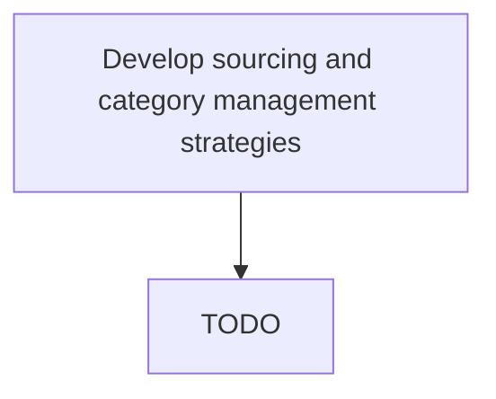

# Develop sourcing and category management strategies

> TODO: Business-as-Code definition for develop sourcing and category management strategies (airline)

## Overview

Deploying a strategic sourcing methodology to segment the majority of organizational spend based on external supply markets (versus individual suppliers or internal stakeholders) to reduce the cost of buying goods and services, reduce risk in the supply chain, and maximize value delivered from the supply base. This approach typically includes cross-functional management of categories, examining the entire category spend, how the organization uses the products or services within the category, the marketplace, and major suppliers.

## Process Hierarchy



## GraphDL

```yaml
develop:
  object: Sourcing And Category Management Strategies
  actor: TODO
  result: TODO
```

## Actions

| Action | Description |
|--------|-------------|
| TODO | TODO |

## Events

| Event | Description |
|-------|-------------|
| TODO | TODO |

## Searches

| Search | Description |
|--------|-------------|
| TODO | TODO |

## Process Flow


## RACI Matrix

| Activity | Responsible | Accountable | Consulted | Informed |
|----------|-------------|-------------|-----------|----------|
| TODO | TODO | TODO | TODO | TODO |

## Related Processes

| Process | Relationship |
|---------|-------------|
| TODO | TODO |

## Related Departments

| Department | Role |
|-----------|------|
| TODO | TODO |

## Related Occupations

| Occupation | Involvement |
|-----------|-------------|
| TODO | TODO |

## KPIs

| KPI | Description | Unit |
|-----|-------------|------|
| TODO | TODO | TODO |

## Usage

```typescript
import { TODO } from '@headlessly/develop-sourcing-and-category-management-strategies'

const client = TODO()

// TODO: Example action calls
```
