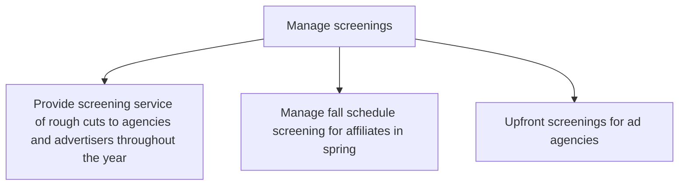

# Manage screenings

> TODO: Business-as-Code definition for manage screenings (broadcasting)

## Overview

Managing screenings throughout the year and by schedule season.  Provision a screening service of rough cuts to the agencies and advertisers throughout the year. Manage fall schedule screening for affiliates in spring and manage upfront screenings for advertisement agencies.

## Process Hierarchy



## GraphDL

```yaml
manage:
  object: Screenings
  actor: TODO
  result: TODO
```

## Actions

| Action | Description |
|--------|-------------|
| TODO | TODO |

## Events

| Event | Description |
|-------|-------------|
| TODO | TODO |

## Searches

| Search | Description |
|--------|-------------|
| TODO | TODO |

## Process Flow


## RACI Matrix

| Activity | Responsible | Accountable | Consulted | Informed |
|----------|-------------|-------------|-----------|----------|
| TODO | TODO | TODO | TODO | TODO |

## Sub-Processes

| ID | Name | Description |
|----|------|-------------|
| 4.11.1 | Provide screening service of rough cuts to agencies and advertisers throughout the year | TODO |
| 4.11.2 | Manage fall schedule screening for affiliates in spring | TODO |
| 4.11.3 | Upfront screenings for ad agencies | TODO |

## Related Processes

| Process | Relationship |
|---------|-------------|
| TODO | TODO |

## Related Departments

| Department | Role |
|-----------|------|
| TODO | TODO |

## Related Occupations

| Occupation | Involvement |
|-----------|-------------|
| TODO | TODO |

## KPIs

| KPI | Description | Unit |
|-----|-------------|------|
| TODO | TODO | TODO |

## Usage

```typescript
import { TODO } from '@headlessly/manage-screenings'

const client = TODO()

// TODO: Example action calls
```
