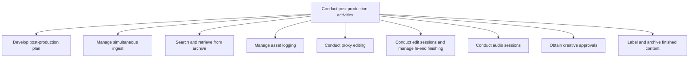

# Conduct post production activities

> TODO: Business-as-Code definition for conduct post production activities (broadcasting)

## Overview

Completing tasked aligned with set post-production activates. These include the development of a post production plan; managing simultaneous ingest, searching, and retrieving from archive; managing asset logging; conducting proxy editing, high-resolution NLE option polishing, conducting edit sessions, managing hi-end finishing, and conducting audio sessions; obtaining creative approvals; and labeling and archiving of the finished content.

## Process Hierarchy



## GraphDL

```yaml
conduct:
  object: Post Production Activities
  actor: TODO
  result: TODO
```

## Actions

| Action | Description |
|--------|-------------|
| TODO | TODO |

## Events

| Event | Description |
|-------|-------------|
| TODO | TODO |

## Searches

| Search | Description |
|--------|-------------|
| TODO | TODO |

## Process Flow


## RACI Matrix

| Activity | Responsible | Accountable | Consulted | Informed |
|----------|-------------|-------------|-----------|----------|
| TODO | TODO | TODO | TODO | TODO |

## Sub-Processes

| ID | Name | Description |
|----|------|-------------|
| 4.6.1 | Develop post-production plan | TODO |
| 4.6.2 | Manage simultaneous ingest | TODO |
| 4.6.3 | Search and retrieve from archive | TODO |
| 4.6.4 | Manage asset logging | TODO |
| 4.6.5 | Conduct proxy editing | TODO |
| 4.6.6 | Conduct edit sessions and manage hi-end finishing | TODO |
| 4.6.7 | Conduct audio sessions | TODO |
| 4.6.8 | Obtain creative approvals | TODO |
| 4.6.9 | Label and archive finished content | TODO |

## Related Processes

| Process | Relationship |
|---------|-------------|
| TODO | TODO |

## Related Departments

| Department | Role |
|-----------|------|
| TODO | TODO |

## Related Occupations

| Occupation | Involvement |
|-----------|-------------|
| TODO | TODO |

## KPIs

| KPI | Description | Unit |
|-----|-------------|------|
| TODO | TODO | TODO |

## Usage

```typescript
import { TODO } from '@headlessly/conduct-post-production-activities'

const client = TODO()

// TODO: Example action calls
```
