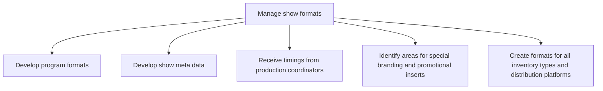

# Manage show formats

> TODO: Business-as-Code definition for manage show formats (broadcasting)

## Overview

Managing show formats entails developing program formats and show meta data, receiving timings from production coordinators, identifying areas for special branding and promotional inserts, and creating formats for all inventory types and distribution platforms.

## Process Hierarchy



## GraphDL

```yaml
manage:
  object: Show Formats
  actor: TODO
  result: TODO
```

## Actions

| Action | Description |
|--------|-------------|
| TODO | TODO |

## Events

| Event | Description |
|-------|-------------|
| TODO | TODO |

## Searches

| Search | Description |
|--------|-------------|
| TODO | TODO |

## Process Flow


## RACI Matrix

| Activity | Responsible | Accountable | Consulted | Informed |
|----------|-------------|-------------|-----------|----------|
| TODO | TODO | TODO | TODO | TODO |

## Sub-Processes

| ID | Name | Description |
|----|------|-------------|
| 4.7.1 | Develop program formats | TODO |
| 4.7.2 | Develop show meta data | TODO |
| 4.7.3 | Receive timings from production coordinators | TODO |
| 4.7.4 | Identify areas for special branding and promotional inserts | TODO |
| 4.7.5 | Create formats for all inventory types and distribution platforms | TODO |

## Related Processes

| Process | Relationship |
|---------|-------------|
| TODO | TODO |

## Related Departments

| Department | Role |
|-----------|------|
| TODO | TODO |

## Related Occupations

| Occupation | Involvement |
|-----------|-------------|
| TODO | TODO |

## KPIs

| KPI | Description | Unit |
|-----|-------------|------|
| TODO | TODO | TODO |

## Usage

```typescript
import { TODO } from '@headlessly/manage-show-formats'

const client = TODO()

// TODO: Example action calls
```
