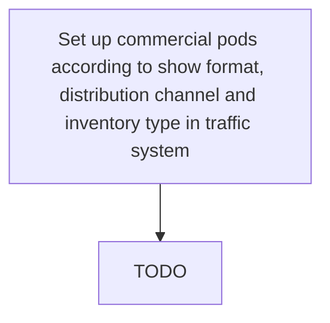

# Set up commercial pods according to show format, distribution channel and inventory type in traffic system

> TODO: Business-as-Code definition for set up commercial pods according to show format, distribution channel and inventory type in traffic system (broadcasting)

## Overview

Running commercials seen from the start of a commercial break to the end of that break, according to show format, distribution channel, and inventory type in the traffic system.

## Process Hierarchy



## GraphDL

```yaml
set:
  object: Up Commercial Pods According To Show Format, Distribution Channel And Inventory Type In Traffic System
  actor: TODO
  result: TODO
```

## Actions

| Action | Description |
|--------|-------------|
| TODO | TODO |

## Events

| Event | Description |
|-------|-------------|
| TODO | TODO |

## Searches

| Search | Description |
|--------|-------------|
| TODO | TODO |

## Process Flow


## RACI Matrix

| Activity | Responsible | Accountable | Consulted | Informed |
|----------|-------------|-------------|-----------|----------|
| TODO | TODO | TODO | TODO | TODO |

## Related Processes

| Process | Relationship |
|---------|-------------|
| TODO | TODO |

## Related Departments

| Department | Role |
|-----------|------|
| TODO | TODO |

## Related Occupations

| Occupation | Involvement |
|-----------|-------------|
| TODO | TODO |

## KPIs

| KPI | Description | Unit |
|-----|-------------|------|
| TODO | TODO | TODO |

## Usage

```typescript
import { TODO } from '@headlessly/set-up-commercial-pods-according-to-show-format,-distribution-channel-and-inventory-type-in-traffic-system'

const client = TODO()

// TODO: Example action calls
```
