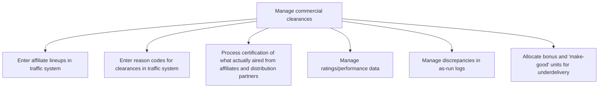

# Manage commercial clearances

> TODO: Business-as-Code definition for manage commercial clearances (broadcasting)

## Overview

Entering, certifying, and allocating activities relating to commercial clearances. Enter affiliate lineups and reason codes for clearances in the traffic system,  and certify what was actually aired from these affiliates and distribution partners. Ratings/performance data and discrepancies in as-run logs are managed.  Sales operations, together with account executives, allocate bonus and 'make-good' units for under delivery.

## Process Hierarchy



## GraphDL

```yaml
manage:
  object: Commercial Clearances
  actor: TODO
  result: TODO
```

## Actions

| Action | Description |
|--------|-------------|
| TODO | TODO |

## Events

| Event | Description |
|-------|-------------|
| TODO | TODO |

## Searches

| Search | Description |
|--------|-------------|
| TODO | TODO |

## Process Flow


## RACI Matrix

| Activity | Responsible | Accountable | Consulted | Informed |
|----------|-------------|-------------|-----------|----------|
| TODO | TODO | TODO | TODO | TODO |

## Sub-Processes

| ID | Name | Description |
|----|------|-------------|
| 4.9.1 | Enter affiliate lineups in traffic system | TODO |
| 4.9.2 | Enter reason codes for clearances in traffic system | TODO |
| 4.9.3 | Process certification of what actually aired from affiliates and distribution partners | TODO |
| 4.9.4 | Manage ratings/performance data | TODO |
| 4.9.5 | Manage discrepancies in as-run logs | TODO |
| 4.9.6 | Allocate bonus and 'make-good' units for underdelivery | TODO |

## Related Processes

| Process | Relationship |
|---------|-------------|
| TODO | TODO |

## Related Departments

| Department | Role |
|-----------|------|
| TODO | TODO |

## Related Occupations

| Occupation | Involvement |
|-----------|-------------|
| TODO | TODO |

## KPIs

| KPI | Description | Unit |
|-----|-------------|------|
| TODO | TODO | TODO |

## Usage

```typescript
import { TODO } from '@headlessly/manage-commercial-clearances'

const client = TODO()

// TODO: Example action calls
```
