# Manage spare parts

> TODO: Business-as-Code definition for manage spare parts (consumer-electronics)

## Overview

TODO: Add process overview

## Process Hierarchy

```mermaid
graph TD
    A[Manage spare parts]
    A --> B[Manage information flow between repair stations]
    A --> C[Capture spare part warranty information from suppliers]
    A --> D[Manage spare parts demand planning exercises]
    A --> E[Develop spare part pricing mechanism]
    A --> F[Define spare parts delivery terms and condition with suppliers]
    A --> G[Establish single point of contact at service call centers]
    A --> H[Establish reverse logistics to reclaim parts are under warranty from suppliers]
    A --> I[Process parts purchase order]
    A --> J[Process inbound parts and confirm receipt]
    A --> K[Manage warehousing and storage]
    A --> L[Maintain physical inventory]
    A --> M[Perform parts cross-docking]
    A --> N[Process sales order]
    A --> O[Process outbound parts]
    A --> P[Execute parts transportation]
    A --> Q[Perform billing]
    A --> R[Process complaints]
    A --> S[Process product service letter]
    A --> T[Monitor and control supply chain]
```



## GraphDL

```yaml
manage:
  object: Spare Parts
  actor: TODO
  result: TODO
```

## Actions

| Action | Description |
|--------|-------------|
| TODO | TODO |

## Events

| Event | Description |
|-------|-------------|
| TODO | TODO |

## Searches

| Search | Description |
|--------|-------------|
| TODO | TODO |

## Process Flow


## RACI Matrix

| Activity | Responsible | Accountable | Consulted | Informed |
|----------|-------------|-------------|-----------|----------|
| TODO | TODO | TODO | TODO | TODO |

## Sub-Processes

| ID | Name | Description |
|----|------|-------------|
| 4.4.5.1 | Manage information flow between repair stations | TODO |
| 4.4.5.2 | Capture spare part warranty information from suppliers | TODO |
| 4.4.5.3 | Manage spare parts demand planning exercises | TODO |
| 4.4.5.4 | Develop spare part pricing mechanism | TODO |
| 4.4.5.5 | Define spare parts delivery terms and condition with suppliers | TODO |
| 4.4.5.6 | Establish single point of contact at service call centers | TODO |
| 4.4.5.7 | Establish reverse logistics to reclaim parts are under warranty from suppliers | TODO |
| 4.4.5.8 | Process parts purchase order | TODO |
| 4.4.5.9 | Process inbound parts and confirm receipt | TODO |
| 4.4.5.10 | Manage warehousing and storage | TODO |
| 4.4.5.11 | Maintain physical inventory | TODO |
| 4.4.5.12 | Perform parts cross-docking | TODO |
| 4.4.5.13 | Process sales order | TODO |
| 4.4.5.14 | Process outbound parts | TODO |
| 4.4.5.15 | Execute parts transportation | TODO |
| 4.4.5.16 | Perform billing | TODO |
| 4.4.5.17 | Process complaints | TODO |
| 4.4.5.18 | Process product service letter | TODO |
| 4.4.5.19 | Monitor and control supply chain | TODO |

## Related Processes

| Process | Relationship |
|---------|-------------|
| TODO | TODO |

## Related Departments

| Department | Role |
|-----------|------|
| TODO | TODO |

## Related Occupations

| Occupation | Involvement |
|-----------|-------------|
| TODO | TODO |

## KPIs

| KPI | Description | Unit |
|-----|-------------|------|
| TODO | TODO | TODO |

## Usage

```typescript
import { TODO } from '@headlessly/manage-spare-parts'

const client = TODO()

// TODO: Example action calls
```
