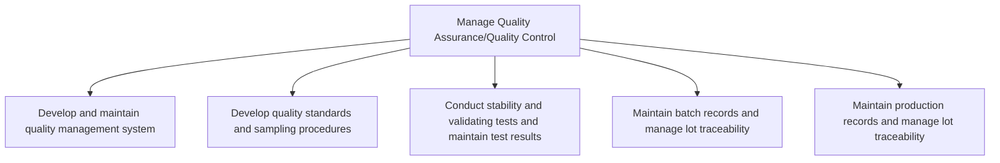

# Manage Quality Assurance/Quality Control

> TODO: Business-as-Code definition for manage quality assurance/quality control (life-sciences)

## Overview

Assuring the quality of the products produced. Develop a quality management system that to include an appropriate organizational structure, procedure, processes and resources, and systematic actions  to meet requirements for quality.  Develop quality standards and sampling procedures.  Obtain a representative portion of a pharmaceutical product, based on an appropriate statistical procedure, for a defined purpose such as the acceptance of consignments or batch release.  Stability and validating tests are conducted and the test results are maintained.  Provide evidence of how the quality of an API (Active pharmaceutical ingredient) or FPP (finished pharmaceutical products) varies with time under the influence of a variety of environmental factors.  Study product-related factors that influence its quality.  Establish a re-test period for the API or a shelf-life for the FPP and recommend storage conditions. Maintain batch records and manage lot traceability to track items created during the Schedule production [10303] and Produce product [10304].

## Process Hierarchy



## GraphDL

```yaml
manage:
  object: Quality Assurance/Quality Control
  actor: TODO
  result: TODO
```

## Actions

| Action | Description |
|--------|-------------|
| TODO | TODO |

## Events

| Event | Description |
|-------|-------------|
| TODO | TODO |

## Searches

| Search | Description |
|--------|-------------|
| TODO | TODO |

## Process Flow


## RACI Matrix

| Activity | Responsible | Accountable | Consulted | Informed |
|----------|-------------|-------------|-----------|----------|
| TODO | TODO | TODO | TODO | TODO |

## Sub-Processes

| ID | Name | Description |
|----|------|-------------|
| 4.4.1 | Develop and maintain quality management system | TODO |
| 4.4.2 | Develop quality standards and sampling procedures | TODO |
| 4.4.3 | Conduct stability and validating tests and maintain test results | TODO |
| 4.4.4 | Maintain batch records and manage lot traceability | TODO |
| 4.4.5 | Maintain production records and manage lot traceability | Perpetuating the production records by systematically documenting and using it to ensure the effecti |

## Related Processes

| Process | Relationship |
|---------|-------------|
| TODO | TODO |

## Related Departments

| Department | Role |
|-----------|------|
| TODO | TODO |

## Related Occupations

| Occupation | Involvement |
|-----------|-------------|
| TODO | TODO |

## KPIs

| KPI | Description | Unit |
|-----|-------------|------|
| TODO | TODO | TODO |

## Usage

```typescript
import { TODO } from '@headlessly/manage-quality-assurance/quality-control'

const client = TODO()

// TODO: Example action calls
```
