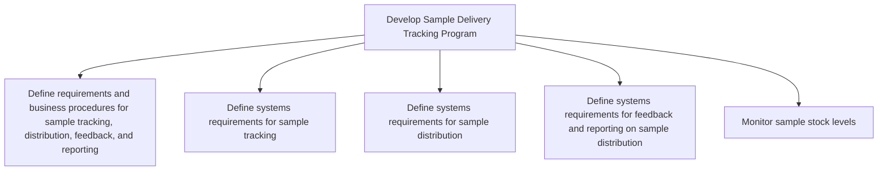

# Develop Sample Delivery Tracking Program

> TODO: Business-as-Code definition for develop sample delivery tracking program (life-sciences)

## Overview

Establishing a technical system to support sample delivery tracking.  Distribute medicinal samples to certified medical practitioners with safeguards.

## Process Hierarchy



## GraphDL

```yaml
develop:
  object: Sample Delivery Tracking Program
  actor: TODO
  result: TODO
```

## Actions

| Action | Description |
|--------|-------------|
| TODO | TODO |

## Events

| Event | Description |
|-------|-------------|
| TODO | TODO |

## Searches

| Search | Description |
|--------|-------------|
| TODO | TODO |

## Process Flow


## RACI Matrix

| Activity | Responsible | Accountable | Consulted | Informed |
|----------|-------------|-------------|-----------|----------|
| TODO | TODO | TODO | TODO | TODO |

## Sub-Processes

| ID | Name | Description |
|----|------|-------------|
| 4.5.1.1 | Define requirements and business procedures for sample tracking, distribution, feedback, and reporting | TODO |
| 4.5.1.2 | Define systems requirements for sample tracking | TODO |
| 4.5.1.3 | Define systems requirements for sample distribution | TODO |
| 4.5.1.4 | Define systems requirements for feedback and reporting on sample distribution | TODO |
| 4.5.1.5 | Monitor sample stock levels | TODO |

## Related Processes

| Process | Relationship |
|---------|-------------|
| TODO | TODO |

## Related Departments

| Department | Role |
|-----------|------|
| TODO | TODO |

## Related Occupations

| Occupation | Involvement |
|-----------|-------------|
| TODO | TODO |

## KPIs

| KPI | Description | Unit |
|-----|-------------|------|
| TODO | TODO | TODO |

## Usage

```typescript
import { TODO } from '@headlessly/develop-sample-delivery-tracking-program'

const client = TODO()

// TODO: Example action calls
```
