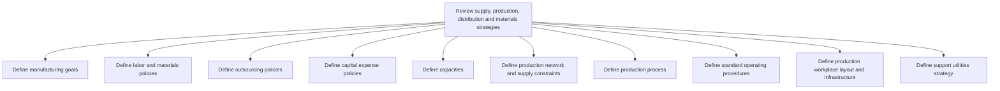

# Review supply, production, distribution and materials strategies

> TODO: Business-as-Code definition for review supply, production, distribution and materials strategies (petroleum-downstream)

## Overview

Creating strategies for production and materials. Handle the demand for the products/services of the organization. Develop plans for handling materials. Develop and administer the schedule for master production. Plan for distribution requirements and its constraints by reviewing and assessing distribution policies and performance and by establishing quality standards and procedures. Production processes are created and standard operating procedures defined.  Standard operating procedures are a detailed explanation of how a policy is to be implemented by providing details about how tasks should be implemented.  The details in a SOP standardize a process and provide step-by-step how-to instructions that enable anyone within the operation to perform the task in a consistent manner e.g. SOPs for start-up, shut-down of units and for changing between product grades.  Production workplace layouts and infrastructures are solidified and a support utilities strategy is defined. These support utilities (gas, electricity, steam, hydrogen, specialty gases, acids, catalysts, etc.) may be supplied by other companies or generated in-house.

## Process Hierarchy



## GraphDL

```yaml
review:
  object: Supply, Production, Distribution And Materials Strategies
  actor: TODO
  result: TODO
```

## Actions

| Action | Description |
|--------|-------------|
| TODO | TODO |

## Events

| Event | Description |
|-------|-------------|
| TODO | TODO |

## Searches

| Search | Description |
|--------|-------------|
| TODO | TODO |

## Process Flow


## RACI Matrix

| Activity | Responsible | Accountable | Consulted | Informed |
|----------|-------------|-------------|-----------|----------|
| TODO | TODO | TODO | TODO | TODO |

## Sub-Processes

| ID | Name | Description |
|----|------|-------------|
| 4.1.1.1 | Define manufacturing goals | Creating quantifiable strategic objectives for each manufacturing segment in conjunction with sales  |
| 4.1.1.2 | Define labor and materials policies | Setting up internal rules and regulations regarding the employees and the materials. |
| 4.1.1.3 | Define outsourcing policies | Creating rules and regulations regarding contracting out of a business process to another party in o |
| 4.1.1.4 | Define capital expense policies | Designing rules and regulations pertaining to the expenditure incurred in acquiring or upgrading the |
| 4.1.1.5 | Define capacities | Outlining the manufacturing and processing capacities of the organization. Delineate the capabilitie |
| 4.1.1.6 | Define production network and supply constraints | Defining limitations in the ability of the organization's supply chain to deliver a new stock, and c |
| 4.1.1.7 | Define production process | Outlining the scheme of processing inventory into finished products/services. This includes the use  |
| 4.1.1.8 | Define standard operating procedures | Establishing or prescribing methods to be followed routinely for the performance of designated opera |
| 4.1.1.9 | Define production workplace layout and infrastructure | Determining the floor plans for the processing facility that is meant for delivering finished produc |
| 4.1.1.10 | Define support utilities strategy | TODO |

## Related Processes

| Process | Relationship |
|---------|-------------|
| TODO | TODO |

## Related Departments

| Department | Role |
|-----------|------|
| TODO | TODO |

## Related Occupations

| Occupation | Involvement |
|-----------|-------------|
| TODO | TODO |

## KPIs

| KPI | Description | Unit |
|-----|-------------|------|
| TODO | TODO | TODO |

## Usage

```typescript
import { TODO } from '@headlessly/review-supply,-production,-distribution-and-materials-strategies'

const client = TODO()

// TODO: Example action calls
```
