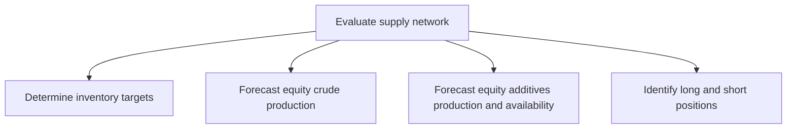

# Evaluate supply network

> TODO: Business-as-Code definition for evaluate supply network (petroleum-downstream)

## Overview

Determining inventory targets and forecasting equity crude production.  Equity additives production and availability is forecast in order to meet emissions requirements, certain government regulators mandate blending of ethanol in gasoline, and impose both volume and composition requirements. Long and short positions are identified.

## Process Hierarchy



## GraphDL

```yaml
evaluate:
  object: Supply Network
  actor: TODO
  result: TODO
```

## Actions

| Action | Description |
|--------|-------------|
| TODO | TODO |

## Events

| Event | Description |
|-------|-------------|
| TODO | TODO |

## Searches

| Search | Description |
|--------|-------------|
| TODO | TODO |

## Process Flow


## RACI Matrix

| Activity | Responsible | Accountable | Consulted | Informed |
|----------|-------------|-------------|-----------|----------|
| TODO | TODO | TODO | TODO | TODO |

## Sub-Processes

| ID | Name | Description |
|----|------|-------------|
| 4.1.3.1 | Determine inventory targets | TODO |
| 4.1.3.2 | Forecast equity crude production | TODO |
| 4.1.3.3 | Forecast equity additives production and availability | TODO |
| 4.1.3.4 | Identify long and short positions | TODO |

## Related Processes

| Process | Relationship |
|---------|-------------|
| TODO | TODO |

## Related Departments

| Department | Role |
|-----------|------|
| TODO | TODO |

## Related Occupations

| Occupation | Involvement |
|-----------|-------------|
| TODO | TODO |

## KPIs

| KPI | Description | Unit |
|-----|-------------|------|
| TODO | TODO | TODO |

## Usage

```typescript
import { TODO } from '@headlessly/evaluate-supply-network'

const client = TODO()

// TODO: Example action calls
```
