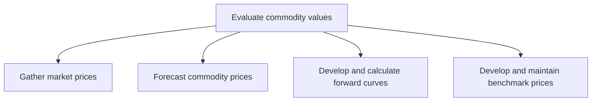

# Evaluate commodity values

> TODO: Business-as-Code definition for evaluate commodity values (petroleum-downstream)

## Overview

Analyzing the various aspects of pricing and forecasting commodity values.  Market prices are gathered, commodity prices forecast, and forward curves are developed and calculated.  Any commodity with a forward market may be said to have a forward curve (a series of sequential prices either for future delivery of an asset or expected future settlements of an index), and the availability and reliability of the forward curve is heavily dependent on the market�s liquidity at each forward month. In the NYMEX natural gas markets, market participants are able to enter into contracts to purchase natural gas deliveries in future months for fixed prices. Benchmark prices are also developed and maintained.

## Process Hierarchy



## GraphDL

```yaml
evaluate:
  object: Commodity Values
  actor: TODO
  result: TODO
```

## Actions

| Action | Description |
|--------|-------------|
| TODO | TODO |

## Events

| Event | Description |
|-------|-------------|
| TODO | TODO |

## Searches

| Search | Description |
|--------|-------------|
| TODO | TODO |

## Process Flow


## RACI Matrix

| Activity | Responsible | Accountable | Consulted | Informed |
|----------|-------------|-------------|-----------|----------|
| TODO | TODO | TODO | TODO | TODO |

## Sub-Processes

| ID | Name | Description |
|----|------|-------------|
| 4.1.7.1 | Gather market prices | TODO |
| 4.1.7.2 | Forecast commodity prices | TODO |
| 4.1.7.3 | Develop and calculate forward curves | TODO |
| 4.1.7.4 | Develop and maintain benchmark prices | TODO |

## Related Processes

| Process | Relationship |
|---------|-------------|
| TODO | TODO |

## Related Departments

| Department | Role |
|-----------|------|
| TODO | TODO |

## Related Occupations

| Occupation | Involvement |
|-----------|-------------|
| TODO | TODO |

## KPIs

| KPI | Description | Unit |
|-----|-------------|------|
| TODO | TODO | TODO |

## Usage

```typescript
import { TODO } from '@headlessly/evaluate-commodity-values'

const client = TODO()

// TODO: Example action calls
```
