# Manage bulk transportation

> TODO: Business-as-Code definition for manage bulk transportation (petroleum-downstream)

## Overview

Managing the bulk transportation of refined products.  Spot and logistics contracts are arranged and pipeline, truck, rail, barge, and/or tanker shipments are scheduled and nominated, and pipeline shipments are managed.  Vessels, wharves/berths, rail and bulk truck shipments are scheduled and all the shipments are managed.  Book transfers, net outs and claims are managed, and the carrier invoices and documents are processed and audited.

## Process Hierarchy

```mermaid
graph TD
    A[Manage bulk transportation]
    A --> B[Arrange logistics contracts]
    A --> C[Schedule and nominate pipeline, truck, rail, barge and/or tanker shipments]
    A --> D[Manage pipeline shipments]
    A --> E[Qualify vessels]
    A --> F[Schedule vessels]
    A --> G[Schedule wharves/berths]
    A --> H[Manage vessel shipments]
    A --> I[Schedule rail]
    A --> J[Manage rail shipments]
    A --> K[Schedule bulk truck shipments]
    A --> L[Manage bulk truck shipments]
    A --> M[Manage book transfers]
    A --> N[Manage net outs]
    A --> O[Manage claims]
    A --> P[Process and audit bulk carrier invoices and documents]
```



## GraphDL

```yaml
manage:
  object: Bulk Transportation
  actor: TODO
  result: TODO
```

## Actions

| Action | Description |
|--------|-------------|
| TODO | TODO |

## Events

| Event | Description |
|-------|-------------|
| TODO | TODO |

## Searches

| Search | Description |
|--------|-------------|
| TODO | TODO |

## Process Flow


## RACI Matrix

| Activity | Responsible | Accountable | Consulted | Informed |
|----------|-------------|-------------|-----------|----------|
| TODO | TODO | TODO | TODO | TODO |

## Sub-Processes

| ID | Name | Description |
|----|------|-------------|
| 4.4.2.1 | Arrange logistics contracts | TODO |
| 4.4.2.2 | Schedule and nominate pipeline, truck, rail, barge and/or tanker shipments | TODO |
| 4.4.2.3 | Manage pipeline shipments | TODO |
| 4.4.2.4 | Qualify vessels | TODO |
| 4.4.2.5 | Schedule vessels | TODO |
| 4.4.2.6 | Schedule wharves/berths | TODO |
| 4.4.2.7 | Manage vessel shipments | TODO |
| 4.4.2.8 | Schedule rail | TODO |
| 4.4.2.9 | Manage rail shipments | TODO |
| 4.4.2.10 | Schedule bulk truck shipments | TODO |
| 4.4.2.11 | Manage bulk truck shipments | TODO |
| 4.4.2.12 | Manage book transfers | TODO |
| 4.4.2.13 | Manage net outs | TODO |
| 4.4.2.14 | Manage claims | TODO |
| 4.4.2.15 | Process and audit bulk carrier invoices and documents | TODO |

## Related Processes

| Process | Relationship |
|---------|-------------|
| TODO | TODO |

## Related Departments

| Department | Role |
|-----------|------|
| TODO | TODO |

## Related Occupations

| Occupation | Involvement |
|-----------|-------------|
| TODO | TODO |

## KPIs

| KPI | Description | Unit |
|-----|-------------|------|
| TODO | TODO | TODO |

## Usage

```typescript
import { TODO } from '@headlessly/manage-bulk-transportation'

const client = TODO()

// TODO: Example action calls
```
