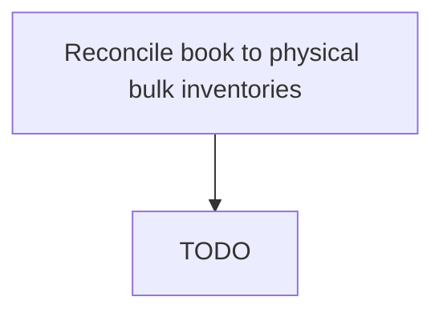

# Reconcile book to physical bulk inventories

> TODO: Business-as-Code definition for reconcile book to physical bulk inventories (petroleum-downstream)

## Overview

This is written from a provider point of view. From the retailer point of view: We forecast demand. We determine best buy. We order. We receive. We reconcile. There are tanks that hold product. You don’t want too much in the tank as it can be risky (price goes down) or too little in the tank (price goes up or you run out). You want just the right amount in the tank unless you are buying long or short and taking a risk on a price move. Likewise when you order, you pay for the fuel so you want to buy smart and you pay for the transportation so you want to order full trucks (there are compartments for different grades) and you want the combination of fuel price and transportation cost to equal the least delivered cost. Sometimes it is smarter to by higher cost fuel from a closer terminal (less transport cost) and visa versa.

## Process Hierarchy



## GraphDL

```yaml
reconcile:
  object: Book To Physical Bulk Inventories
  actor: TODO
  result: TODO
```

## Actions

| Action | Description |
|--------|-------------|
| TODO | TODO |

## Events

| Event | Description |
|-------|-------------|
| TODO | TODO |

## Searches

| Search | Description |
|--------|-------------|
| TODO | TODO |

## Process Flow


## RACI Matrix

| Activity | Responsible | Accountable | Consulted | Informed |
|----------|-------------|-------------|-----------|----------|
| TODO | TODO | TODO | TODO | TODO |

## Related Processes

| Process | Relationship |
|---------|-------------|
| TODO | TODO |

## Related Departments

| Department | Role |
|-----------|------|
| TODO | TODO |

## Related Occupations

| Occupation | Involvement |
|-----------|-------------|
| TODO | TODO |

## KPIs

| KPI | Description | Unit |
|-----|-------------|------|
| TODO | TODO | TODO |

## Usage

```typescript
import { TODO } from '@headlessly/reconcile-book-to-physical-bulk-inventories'

const client = TODO()

// TODO: Example action calls
```
