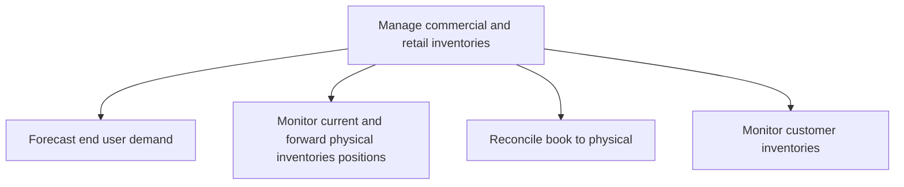

# Manage commercial and retail inventories

> TODO: Business-as-Code definition for manage commercial and retail inventories (petroleum-downstream)

## Overview

Handling commercial and retail inventories from a provider perspective. It begins with a forecast of end user demand, followed by a monitoring of current and forward/future positions, the reconciliation of book to physical inventory, and the monitoring of customer inventories.  From a customer (i.e. retail or commercial/industrial (C&I)) perspective, getting the fuel to a tank 9last mile) so it can be used. Tank inventory is managed.  Demand is forecast, best buy is determined, the order is placed and received and finally, reconciliation is performed.

## Process Hierarchy



## GraphDL

```yaml
manage:
  object: Commercial And Retail Inventories
  actor: TODO
  result: TODO
```

## Actions

| Action | Description |
|--------|-------------|
| TODO | TODO |

## Events

| Event | Description |
|-------|-------------|
| TODO | TODO |

## Searches

| Search | Description |
|--------|-------------|
| TODO | TODO |

## Process Flow


## RACI Matrix

| Activity | Responsible | Accountable | Consulted | Informed |
|----------|-------------|-------------|-----------|----------|
| TODO | TODO | TODO | TODO | TODO |

## Sub-Processes

| ID | Name | Description |
|----|------|-------------|
| 4.4.6.1 | Forecast end user demand | TODO |
| 4.4.6.2 | Monitor current and forward physical inventories positions | TODO |
| 4.4.6.3 | Reconcile book to physical | TODO |
| 4.4.6.4 | Monitor customer inventories | TODO |

## Related Processes

| Process | Relationship |
|---------|-------------|
| TODO | TODO |

## Related Departments

| Department | Role |
|-----------|------|
| TODO | TODO |

## Related Occupations

| Occupation | Involvement |
|-----------|-------------|
| TODO | TODO |

## KPIs

| KPI | Description | Unit |
|-----|-------------|------|
| TODO | TODO | TODO |

## Usage

```typescript
import { TODO } from '@headlessly/manage-commercial-and-retail-inventories'

const client = TODO()

// TODO: Example action calls
```
