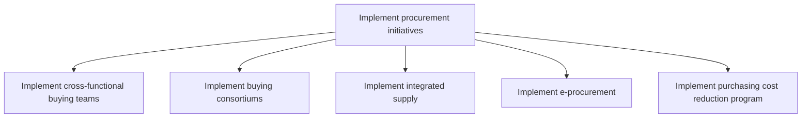

# Implement procurement initiatives

> TODO: Business-as-Code definition for implement procurement initiatives (consumer-products)

## Overview

TODO: Add process overview

## Process Hierarchy



## GraphDL

```yaml
implement:
  object: Procurement Initiatives
  actor: TODO
  result: TODO
```

## Actions

| Action | Description |
|--------|-------------|
| TODO | TODO |

## Events

| Event | Description |
|-------|-------------|
| TODO | TODO |

## Searches

| Search | Description |
|--------|-------------|
| TODO | TODO |

## Process Flow


## RACI Matrix

| Activity | Responsible | Accountable | Consulted | Informed |
|----------|-------------|-------------|-----------|----------|
| TODO | TODO | TODO | TODO | TODO |

## Sub-Processes

| ID | Name | Description |
|----|------|-------------|
| 4.2.6.1 | Implement cross-functional buying teams | TODO |
| 4.2.6.2 | Implement buying consortiums | TODO |
| 4.2.6.3 | Implement integrated supply | TODO |
| 4.2.6.4 | Implement e-procurement | TODO |
| 4.2.6.5 | Implement purchasing cost reduction program | TODO |

## Related Processes

| Process | Relationship |
|---------|-------------|
| TODO | TODO |

## Related Departments

| Department | Role |
|-----------|------|
| TODO | TODO |

## Related Occupations

| Occupation | Involvement |
|-----------|-------------|
| TODO | TODO |

## KPIs

| KPI | Description | Unit |
|-----|-------------|------|
| TODO | TODO | TODO |

## Usage

```typescript
import { TODO } from '@headlessly/implement-procurement-initiatives'

const client = TODO()

// TODO: Example action calls
```
