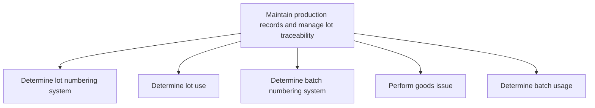

# Maintain production records and manage lot traceability

> TODO: Business-as-Code definition for maintain production records and manage lot traceability (consumer-products)

## Overview

TODO: Add process overview

## Process Hierarchy



## GraphDL

```yaml
maintain:
  object: Production Records And Manage Lot Traceability
  actor: TODO
  result: TODO
```

## Actions

| Action | Description |
|--------|-------------|
| TODO | TODO |

## Events

| Event | Description |
|-------|-------------|
| TODO | TODO |

## Searches

| Search | Description |
|--------|-------------|
| TODO | TODO |

## Process Flow


## RACI Matrix

| Activity | Responsible | Accountable | Consulted | Informed |
|----------|-------------|-------------|-----------|----------|
| TODO | TODO | TODO | TODO | TODO |

## Sub-Processes

| ID | Name | Description |
|----|------|-------------|
| 4.3.4.1 | Determine lot numbering system | Allotting an identification number to a particular quantity or lot of material manufactured. Assign  |
| 4.3.4.2 | Determine lot use | Identifying the use of production lots. Define where, how, and when to use a specific production lot |
| 4.3.4.3 | Determine batch numbering system | TODO |
| 4.3.4.4 | Perform goods issue | TODO |
| 4.3.4.5 | Determine batch usage | TODO |

## Related Processes

| Process | Relationship |
|---------|-------------|
| TODO | TODO |

## Related Departments

| Department | Role |
|-----------|------|
| TODO | TODO |

## Related Occupations

| Occupation | Involvement |
|-----------|-------------|
| TODO | TODO |

## KPIs

| KPI | Description | Unit |
|-----|-------------|------|
| TODO | TODO | TODO |

## Usage

```typescript
import { TODO } from '@headlessly/maintain-production-records-and-manage-lot-traceability'

const client = TODO()

// TODO: Example action calls
```
