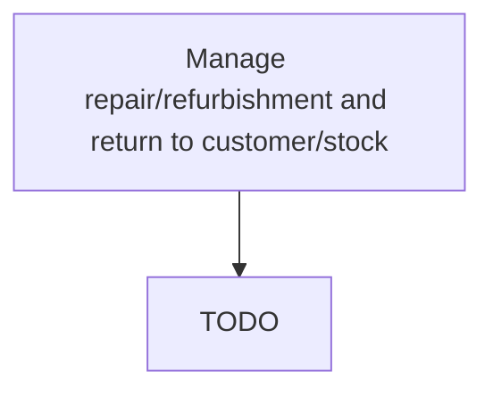

# Manage repair/refurbishment and return to customer/stock

> TODO: Business-as-Code definition for manage repair/refurbishment and return to customer/stock (consumer-products)

## Overview

Administering the reinstatement of the returned product in order to return them back to customers. Repair or remanufacture the defective or ineffective products returned by the customer. Process the delivery of the repaired or remanufactured products back to the customer.

## Process Hierarchy



## GraphDL

```yaml
manage:
  object: Repair/refurbishment And Return To Customer/stock
  actor: TODO
  result: TODO
```

## Actions

| Action | Description |
|--------|-------------|
| TODO | TODO |

## Events

| Event | Description |
|-------|-------------|
| TODO | TODO |

## Searches

| Search | Description |
|--------|-------------|
| TODO | TODO |

## Process Flow


## RACI Matrix

| Activity | Responsible | Accountable | Consulted | Informed |
|----------|-------------|-------------|-----------|----------|
| TODO | TODO | TODO | TODO | TODO |

## Related Processes

| Process | Relationship |
|---------|-------------|
| TODO | TODO |

## Related Departments

| Department | Role |
|-----------|------|
| TODO | TODO |

## Related Occupations

| Occupation | Involvement |
|-----------|-------------|
| TODO | TODO |

## KPIs

| KPI | Description | Unit |
|-----|-------------|------|
| TODO | TODO | TODO |

## Usage

```typescript
import { TODO } from '@headlessly/manage-repair/refurbishment-and-return-to-customer/stock'

const client = TODO()

// TODO: Example action calls
```
