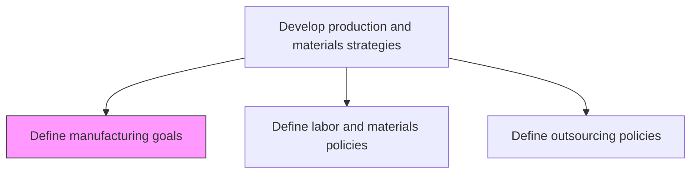
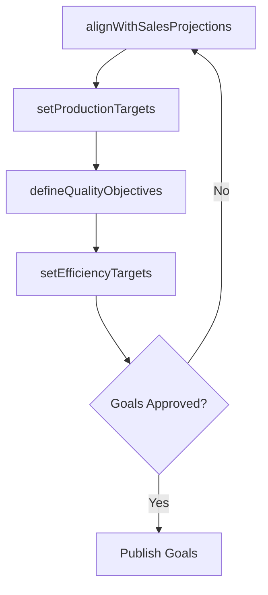

# Define manufacturing goals

> Business-as-Code definition for manufacturing goal setting. Models the creation, alignment, and tracking of quantifiable production objectives tied to sales projections and organizational strategy.

## Overview

Creating quantifiable strategic objectives for each manufacturing segment in conjunction with sales projections. This involves setting specific output volume targets, throughput rates, yield improvement goals, and cost-per-unit objectives for every production line and facility. Manufacturing goals are developed collaboratively with sales, finance, and operations leadership to ensure alignment between market demand, financial feasibility, and production capacity.

## Process Hierarchy



## GraphDL

```yaml
define:
  object: Manufacturing Goals
  actor: ManufacturingDirector
  result: ManufacturingGoalSet
```

## Actions

| Action | Description |
|--------|-------------|
| setProductionTargets | Establish output volume and throughput targets by segment |
| alignWithSalesProjections | Synchronize manufacturing goals with sales demand forecasts |
| defineQualityObjectives | Set quality and defect-rate objectives for production |
| setEfficiencyTargets | Establish cost-per-unit and yield improvement targets |

## Events

| Event | Description |
|-------|-------------|
| productionTargetsSet | Volume and throughput targets established for planning period |
| goalsAlignedWithSales | Manufacturing goals reconciled with sales projections |
| qualityObjectivesDefined | Quality and defect-rate targets published |
| efficiencyTargetsSet | Cost and yield improvement targets approved |

## Searches

| Search | Description |
|--------|-------------|
| getManufacturingGoals | Retrieve goals by segment, period, or metric type |
| getGoalProgress | Track goal attainment against targets |
| getSalesAlignment | Query alignment between manufacturing goals and sales forecasts |

## Process Flow



## RACI Matrix

| Activity | Responsible | Accountable | Consulted | Informed |
|----------|-------------|-------------|-----------|----------|
| setProductionTargets | ProductionPlanner | ManufacturingDirector | Sales, Finance | Operations |
| alignWithSalesProjections | DemandPlanner | ManufacturingDirector | SalesDirector | SupplyChain |
| defineQualityObjectives | QualityManager | ManufacturingDirector | Engineering | Production |

## Related Processes

| Process | Relationship |
|---------|-------------|
| 4.1.1.2 Define labor and materials policies | Sibling - goals drive policy requirements |
| 4.1.1.5 Define capacities | Downstream - goals inform capacity planning |
| 4.1.2 Plan sales and operations | Upstream - S&OP provides demand inputs |

## Related Departments

| Department | Role |
|-----------|------|
| Manufacturing | Primary owner of goal definition |
| Sales | Provides demand projections and revenue targets |
| Finance | Validates financial feasibility of production targets |

## Related Occupations

| Occupation | Involvement |
|-----------|-------------|
| Manufacturing Director | Goal approval and strategic alignment |
| Production Planner | Target development and feasibility analysis |

## KPIs

| KPI | Description | Unit |
|-----|-------------|------|
| Goal Attainment Rate | Percentage of manufacturing goals met within period | % |
| Production Volume Accuracy | Variance between target and actual output | % |
| Cost Per Unit Target | Achievement of unit cost reduction goals | Currency |

## Usage

```typescript
import { defineManufacturingGoals } from '@headlessly/define-manufacturing-goals'

const client = defineManufacturingGoals()

// Set production targets
const targets = await client.setProductionTargets({
  segment: 'Consumer Electronics',
  period: 'FY2025',
  volumeTarget: 500000,
  yieldTarget: 98.5
})
```
