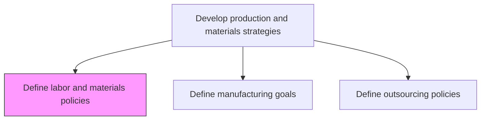
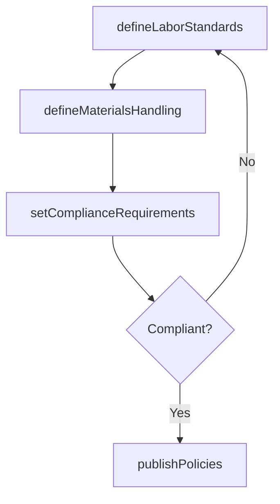

# Define labor and materials policies

> Business-as-Code definition for labor and materials policy creation. Models workforce allocation rules, materials handling standards, and compliance requirements as programmable policy definitions.

## Overview

Setting up internal rules and regulations regarding the workforce and materials used in production operations. This includes defining labor scheduling policies, overtime guidelines, staffing ratios, and worker safety requirements, as well as establishing materials handling standards, storage protocols, quality acceptance criteria, and waste reduction targets. These policies ensure consistent, compliant, and cost-effective management of the two most significant production resources.

## Process Hierarchy



## GraphDL

```yaml
define:
  object: Labor And Materials Policies
  actor: OperationsDirector
  result: LaborMaterialsPolicy
```

## Actions

| Action | Description |
|--------|-------------|
| defineLaborStandards | Establish workforce scheduling, overtime, and staffing policies |
| defineMaterialsHandling | Set standards for materials storage, handling, and usage |
| setComplianceRequirements | Define regulatory and safety compliance requirements |
| publishPolicies | Distribute approved policies to relevant stakeholders |

## Events

| Event | Description |
|-------|-------------|
| laborStandardsDefined | Workforce policies documented and approved |
| materialsHandlingDefined | Materials handling standards published |
| complianceRequirementsSet | Regulatory compliance requirements established |
| policiesPublished | Policies distributed to all affected departments |

## Searches

| Search | Description |
|--------|-------------|
| getLaborPolicies | Retrieve labor policies by facility, role, or regulation type |
| getMaterialsPolicies | Query materials handling standards by category or facility |
| getComplianceStatus | Check compliance status against defined requirements |

## Process Flow



## RACI Matrix

| Activity | Responsible | Accountable | Consulted | Informed |
|----------|-------------|-------------|-----------|----------|
| defineLaborStandards | HRManager | OperationsDirector | Legal, UnionReps | Production |
| defineMaterialsHandling | MaterialsManager | OperationsDirector | Safety, QA | Warehouse |
| setComplianceRequirements | ComplianceOfficer | OperationsDirector | Legal, EHS | Executive |

## Related Processes

| Process | Relationship |
|---------|-------------|
| 4.1.1.1 Define manufacturing goals | Upstream - goals drive labor and materials requirements |
| 4.1.1.3 Define outsourcing policies | Sibling - outsourcing affects labor allocation |
| 7.1 Develop and manage human resources planning | Parallel - HR policies align with labor standards |

## Related Departments

| Department | Role |
|-----------|------|
| Operations | Primary owner of labor and materials policies |
| Human Resources | Ensures labor policy compliance with employment law |
| EHS | Reviews safety requirements for materials handling |

## Related Occupations

| Occupation | Involvement |
|-----------|-------------|
| Operations Director | Policy approval and enforcement |
| HR Manager | Labor standards development |

## KPIs

| KPI | Description | Unit |
|-----|-------------|------|
| Policy Compliance Rate | Percentage of operations compliant with defined policies | % |
| Materials Waste Rate | Percentage of materials lost to non-compliance | % |
| Labor Policy Grievances | Number of policy-related workforce grievances | Count |

## Usage

```typescript
import { defineLaborAndMaterialsPolicies } from '@headlessly/define-labor-and-materials-policies'

const client = defineLaborAndMaterialsPolicies()

// Define labor standards
const standards = await client.defineLaborStandards({
  facility: 'PLANT-EAST',
  shiftPattern: '3-shift-rotation',
  maxOvertimeHours: 10,
  minimumStaffingRatio: 0.85
})
```
