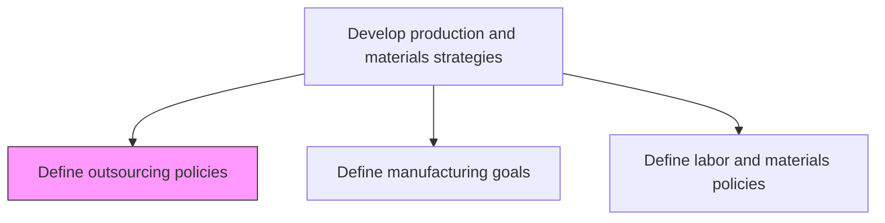
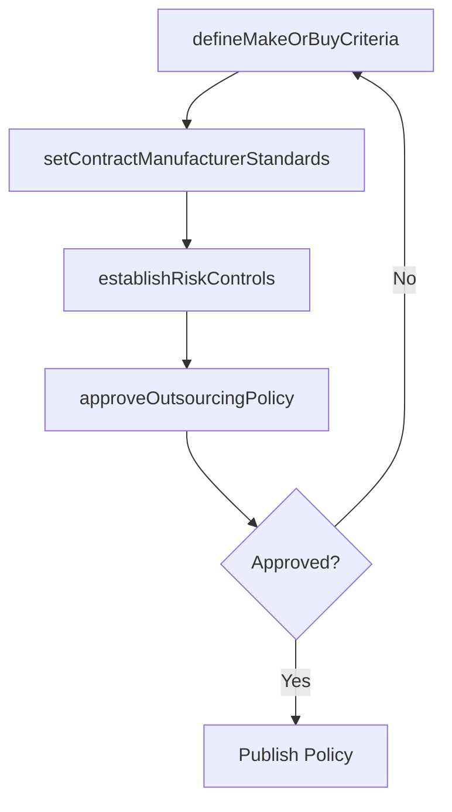

# Define outsourcing policies

> Business-as-Code definition for outsourcing policy creation. Models make-versus-buy criteria, contract manufacturer governance, quality requirements, and risk management for outsourced production as programmable policies.

## Overview

Creating rules and regulations regarding contracting out of a business process to another party in order to reduce costs, access specialized capabilities, or increase production flexibility. This includes establishing make-versus-buy decision criteria, defining quality and compliance requirements for contract manufacturers, setting intellectual property protection standards, and specifying performance monitoring and governance expectations for outsourced operations.

## Process Hierarchy



## GraphDL

```yaml
define:
  object: Outsourcing Policies
  actor: SupplyChainDirector
  result: OutsourcingPolicy
```

## Actions

| Action | Description |
|--------|-------------|
| defineMakeOrBuyCriteria | Establish decision criteria for in-house versus outsourced production |
| setContractManufacturerStandards | Define quality and compliance requirements for contract manufacturers |
| establishRiskControls | Set risk mitigation policies for outsourced operations |
| approveOutsourcingPolicy | Review and approve consolidated outsourcing policy framework |

## Events

| Event | Description |
|-------|-------------|
| makeOrBuyCriteriaDefined | Decision framework for outsourcing established |
| contractManufacturerStandardsSet | Quality standards for outsourced partners published |
| riskControlsEstablished | Risk mitigation measures for outsourcing documented |
| outsourcingPolicyApproved | Outsourcing policy approved and communicated |

## Searches

| Search | Description |
|--------|-------------|
| getOutsourcingPolicies | Retrieve outsourcing policies by product line or region |
| getMakeOrBuyDecisions | Query make-versus-buy analyses and outcomes |
| getContractManufacturerStandards | Retrieve quality requirements for outsourced partners |

## Process Flow



## RACI Matrix

| Activity | Responsible | Accountable | Consulted | Informed |
|----------|-------------|-------------|-----------|----------|
| defineMakeOrBuyCriteria | SupplyChainAnalyst | SupplyChainDirector | Finance, Manufacturing | Procurement |
| setContractManufacturerStandards | QualityManager | SupplyChainDirector | Legal, Engineering | Suppliers |

## Related Processes

| Process | Relationship |
|---------|-------------|
| 4.1.1.2 Define labor and materials policies | Sibling - outsourcing changes labor needs |
| 4.2.3 Select suppliers and develop/maintain contracts | Downstream - policies guide supplier selection |
| 4.1.1.6 Define production network and supply constraints | Sibling - outsourcing expands production network |

## Related Departments

| Department | Role |
|-----------|------|
| Supply Chain | Primary owner of outsourcing strategy and policy |
| Procurement | Executes vendor selection per outsourcing policy |
| Legal | Reviews contract terms and IP protection |

## Related Occupations

| Occupation | Involvement |
|-----------|-------------|
| Supply Chain Director | Overall outsourcing policy ownership |
| Procurement Manager | Vendor evaluation and contracting |

## KPIs

| KPI | Description | Unit |
|-----|-------------|------|
| Outsourcing Cost Savings | Cost reduction achieved through outsourcing | % |
| Supplier Quality Compliance | Percentage of outsourced products meeting quality standards | % |
| Policy Adherence Rate | Percentage of outsourcing decisions following defined policies | % |

## Usage

```typescript
import { defineOutsourcingPolicies } from '@headlessly/define-outsourcing-policies'

const client = defineOutsourcingPolicies()

// Define make-or-buy criteria
const criteria = await client.defineMakeOrBuyCriteria({
  productLine: 'Assemblies',
  evaluationFactors: ['cost', 'quality', 'lead-time', 'ip-risk'],
  minimumCostSavings: 15
})
```
