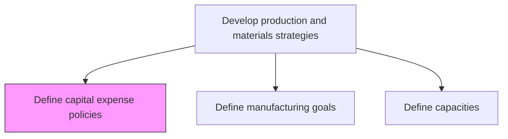
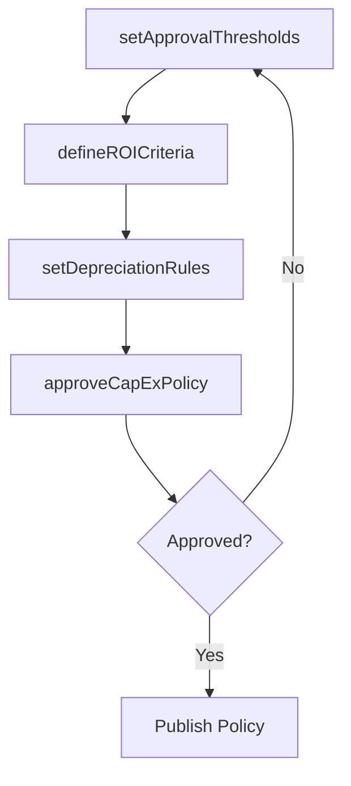

# Define capital expense policies

> Business-as-Code definition for capital expenditure policy creation. Models investment approval thresholds, depreciation rules, ROI criteria, and equipment lifecycle management as programmable policies.

## Overview

Designing rules and regulations pertaining to the expenditure incurred in acquiring or upgrading the existing stock of manufacturing capital.

## Process Hierarchy



## GraphDL

```yaml
define:
  object: Capital Expense Policies
  actor: FinanceDirector
  result: CapExPolicy
```

## Actions

| Action | Description |
|--------|-------------|
| setApprovalThresholds | Define spending limits and approval authority levels for capital requests |
| defineROICriteria | Establish return-on-investment requirements for capital projects |
| setDepreciationRules | Define asset depreciation methods and useful life estimates |
| approveCapExPolicy | Review and approve the consolidated capital expense policy |

## Events

| Event | Description |
|-------|-------------|
| approvalThresholdsSet | Capital spending authority levels defined and published |
| roiCriteriaDefined | Investment return requirements established |
| depreciationRulesSet | Asset depreciation standards documented |
| capExPolicyApproved | Capital expense policy approved by executive leadership |

## Searches

| Search | Description |
|--------|-------------|
| getCapExPolicies | Retrieve capital expense policies by category or facility |
| getApprovalLimits | Query approval thresholds by role or project type |
| getROIRequirements | Retrieve minimum ROI criteria for capital investments |

## Process Flow



## RACI Matrix

| Activity | Responsible | Accountable | Consulted | Informed |
|----------|-------------|-------------|-----------|----------|
| setApprovalThresholds | FinancialController | FinanceDirector | Executive, Manufacturing | AllDepartments |
| defineROICriteria | FinancialAnalyst | FinanceDirector | CapitalPlanning | Manufacturing |

## Related Processes

| Process | Relationship |
|---------|-------------|
| 4.1.1.1 Define manufacturing goals | Upstream - production goals drive capital investment needs |
| 4.1.1.5 Define capacities | Downstream - capital policies constrain capacity expansion |
| 8.1 Manage the budget | Parallel - capital budget aligns with CapEx policies |

## Related Departments

| Department | Role |
|-----------|------|
| Finance | Primary owner of capital expenditure policies |
| Manufacturing | Submits capital requests and justifications |
| Executive Leadership | Approves high-value capital investments |

## Related Occupations

| Occupation | Involvement |
|-----------|-------------|
| Finance Director | Policy ownership and approval authority |
| Financial Analyst | ROI analysis and depreciation modeling |

## KPIs

| KPI | Description | Unit |
|-----|-------------|------|
| CapEx Budget Adherence | Actual capital spending versus approved budget | % |
| Average ROI on Capital | Return on invested capital for manufacturing assets | % |
| Approval Cycle Time | Average time from capital request to approval decision | Days |

## Usage

```typescript
import { defineCapitalExpensePolicies } from '@headlessly/define-capital-expense-policies'

const client = defineCapitalExpensePolicies()

// Set approval thresholds
const thresholds = await client.setApprovalThresholds({
  levels: [
    { maxAmount: 10000, approver: 'DepartmentManager' },
    { maxAmount: 100000, approver: 'VPManufacturing' },
    { maxAmount: Infinity, approver: 'CFO' }
  ]
})
```
