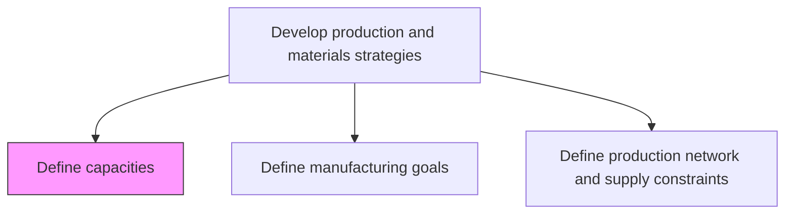
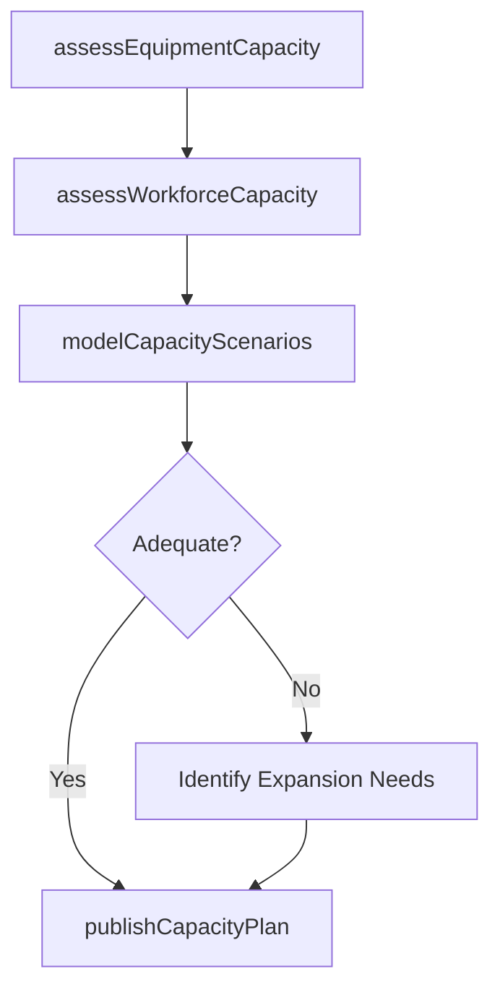

# Define capacities

> Business-as-Code definition for capacity planning and definition. Models the assessment of manufacturing throughput, equipment capability, workforce capacity, and resource optimization as programmable capacity profiles.

## Overview

Outlining the manufacturing and processing capacities of the organization. Delineate the capabilities required for optimizing output with available resources. Analyze capabilities possessed by the organization concerning the raw materials required and the process necessitated for producing finished products.

## Process Hierarchy



## GraphDL

```yaml
define:
  object: Capacities
  actor: CapacityPlanningManager
  result: CapacityProfile
```

## Actions

| Action | Description |
|--------|-------------|
| assessEquipmentCapacity | Measure maximum throughput of production equipment and lines |
| assessWorkforceCapacity | Determine available labor hours and skill capacity |
| modelCapacityScenarios | Simulate capacity utilization under different demand scenarios |
| publishCapacityPlan | Document and distribute approved capacity definitions |

## Events

| Event | Description |
|-------|-------------|
| equipmentCapacityAssessed | Equipment throughput measurements completed |
| workforceCapacityAssessed | Labor capacity analysis documented |
| capacityScenariosModeled | Capacity simulation scenarios generated |
| capacityPlanPublished | Capacity definitions approved and distributed |

## Searches

| Search | Description |
|--------|-------------|
| getCapacityByFacility | Retrieve capacity data by plant, line, or work center |
| getCapacityUtilization | Query current utilization rates against defined capacity |
| getCapacityScenarios | Retrieve capacity simulation results |

## Process Flow



## RACI Matrix

| Activity | Responsible | Accountable | Consulted | Informed |
|----------|-------------|-------------|-----------|----------|
| assessEquipmentCapacity | IndustrialEngineer | CapacityPlanningManager | Maintenance, Production | Finance |
| assessWorkforceCapacity | HRAnalyst | CapacityPlanningManager | HR, ProductionLeads | Planning |

## Related Processes

| Process | Relationship |
|---------|-------------|
| 4.1.1.1 Define manufacturing goals | Upstream - goals drive capacity requirements |
| 4.1.1.4 Define capital expense policies | Upstream - CapEx policies constrain expansion |
| 4.1.5 Create and manage master production schedule | Downstream - capacity feeds production scheduling |

## Related Departments

| Department | Role |
|-----------|------|
| Capacity Planning | Primary owner of capacity definition and analysis |
| Manufacturing Engineering | Provides equipment capability data |
| Human Resources | Supplies workforce availability information |

## Related Occupations

| Occupation | Involvement |
|-----------|-------------|
| Capacity Planning Manager | Capacity analysis and scenario planning |
| Industrial Engineer | Equipment throughput measurement |

## KPIs

| KPI | Description | Unit |
|-----|-------------|------|
| Capacity Utilization Rate | Actual output versus maximum defined capacity | % |
| Capacity Accuracy | Variance between defined and demonstrated capacity | % |
| Bottleneck Identification | Number of capacity constraints identified and addressed | Count |

## Usage

```typescript
import { defineCapacities } from '@headlessly/define-capacities'

const client = defineCapacities()

// Assess equipment capacity
const capacity = await client.assessEquipmentCapacity({
  facility: 'PLANT-WEST',
  productionLine: 'LINE-B2',
  measurementPeriod: '30-days',
  includeDowntime: true
})
```
