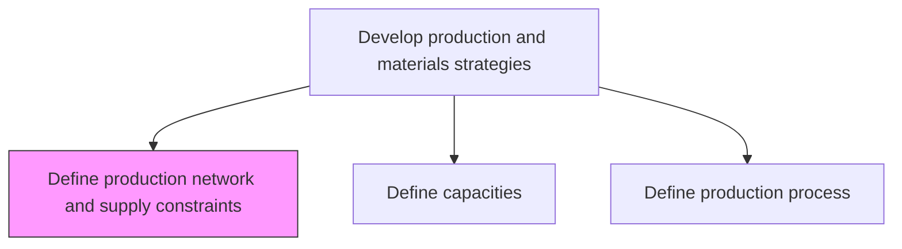
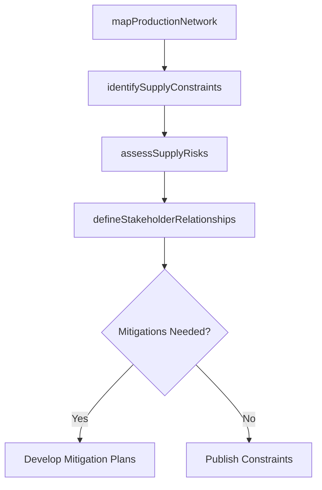

# Define production network and supply constraints

> Business-as-Code definition for production network and supply constraint mapping. Models supply chain topology, constraint identification, stakeholder relationships, and supply risk assessment as programmable network definitions.

## Overview

Defining limitations in the ability of the organization's supply chain to deliver a new stock, and creating a network of production stakeholders. Frame and manage relationships within the flow of manufacturing and processing operations. Identify probable supply issues.

## Process Hierarchy



## GraphDL

```yaml
define:
  object: Production Network And Supply Constraints
  actor: SupplyChainPlanner
  result: NetworkConstraintMap
```

## Actions

| Action | Description |
|--------|-------------|
| mapProductionNetwork | Document the topology of production facilities and supply routes |
| identifySupplyConstraints | Catalog limitations in supply chain delivery capability |
| assessSupplyRisks | Evaluate probability and impact of supply disruptions |
| defineStakeholderRelationships | Establish roles and responsibilities across the production network |

## Events

| Event | Description |
|-------|-------------|
| productionNetworkMapped | Network topology documented with all facilities and routes |
| supplyConstraintsIdentified | Supply chain limitations cataloged and prioritized |
| supplyRisksAssessed | Risk assessment completed for identified constraints |
| stakeholderRelationshipsDefined | Network partner roles and responsibilities documented |

## Searches

| Search | Description |
|--------|-------------|
| getNetworkTopology | Retrieve production network map by region or product line |
| getConstraints | Query supply constraints by severity, type, or location |
| getSupplyRiskProfile | Retrieve supply risk assessment results |

## Process Flow



## RACI Matrix

| Activity | Responsible | Accountable | Consulted | Informed |
|----------|-------------|-------------|-----------|----------|
| mapProductionNetwork | SupplyChainPlanner | SupplyChainDirector | Manufacturing, Logistics | Executive |
| identifySupplyConstraints | SupplyChainAnalyst | SupplyChainDirector | Procurement, Suppliers | Planning |

## Related Processes

| Process | Relationship |
|---------|-------------|
| 4.1.1.5 Define capacities | Upstream - capacity data feeds constraint analysis |
| 4.1.4.3 Identify critical materials and supplier capacity | Downstream - constraints inform critical materials identification |
| 4.2.5 Manage suppliers | Parallel - supplier performance affects supply constraints |

## Related Departments

| Department | Role |
|-----------|------|
| Supply Chain Planning | Primary owner of network and constraint definitions |
| Procurement | Provides supplier capability data |
| Logistics | Identifies transportation and distribution constraints |

## Related Occupations

| Occupation | Involvement |
|-----------|-------------|
| Supply Chain Planner | Network mapping and constraint identification |
| Supply Chain Analyst | Risk assessment and mitigation planning |

## KPIs

| KPI | Description | Unit |
|-----|-------------|------|
| Constraint Resolution Rate | Percentage of identified constraints with active mitigations | % |
| Supply Disruption Frequency | Number of unplanned supply disruptions per period | Count |
| Network Resilience Score | Assessed ability to absorb and recover from disruptions | Score (1-10) |

## Usage

```typescript
import { defineProductionNetworkAndSupplyConstraints } from '@headlessly/define-production-network-and-supply-constraints'

const client = defineProductionNetworkAndSupplyConstraints()

// Map production network
const network = await client.mapProductionNetwork({
  region: 'North America',
  includeSuppliers: true,
  includeDistributionCenters: true
})
```
