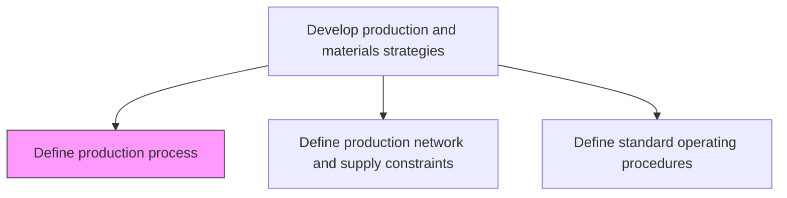
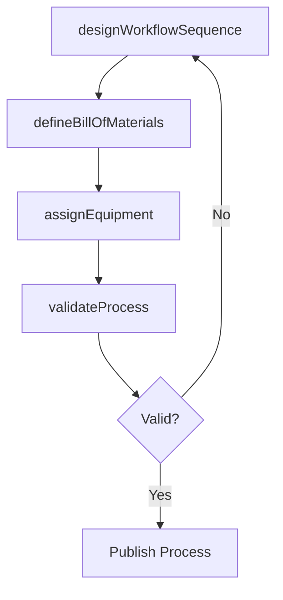

# Define production process

> Business-as-Code definition for production process design. Models workflow sequencing, bill-of-materials structuring, equipment assignment, and process validation as programmable process definitions.

## Overview

Outlining the scheme of processing inventory into finished products/services. This includes the use of raw materials, machinery, skill sets, and knowledge to create new offerings.

## Process Hierarchy



## GraphDL

```yaml
define:
  object: Production Process
  actor: ProcessEngineer
  result: ProductionProcessDefinition
```

## Actions

| Action | Description |
|--------|-------------|
| designWorkflowSequence | Map the sequence of operations from raw materials to finished goods |
| defineBillOfMaterials | Specify materials, quantities, and assemblies for each product |
| assignEquipment | Allocate machinery and tooling to each production step |
| validateProcess | Test and confirm production process meets quality and throughput targets |

## Events

| Event | Description |
|-------|-------------|
| workflowSequenceDesigned | Production workflow steps documented and sequenced |
| billOfMaterialsDefined | BOM structure created for product |
| equipmentAssigned | Machinery and tooling allocated to process steps |
| processValidated | Production process tested and confirmed operational |

## Searches

| Search | Description |
|--------|-------------|
| getProcessDefinition | Retrieve production process details by product or line |
| getBillOfMaterials | Query BOM structure for a specific product |
| getEquipmentAssignments | List equipment allocated to production process steps |

## Process Flow



## RACI Matrix

| Activity | Responsible | Accountable | Consulted | Informed |
|----------|-------------|-------------|-----------|----------|
| designWorkflowSequence | ProcessEngineer | ManufacturingDirector | Production, QA | Planning |
| defineBillOfMaterials | ProductEngineer | ManufacturingDirector | Procurement, Design | Finance |

## Related Processes

| Process | Relationship |
|---------|-------------|
| 4.1.1.6 Define production network and supply constraints | Upstream - network constraints shape process design |
| 4.1.1.8 Define standard operating procedures | Downstream - process design drives SOP creation |
| 4.3.2 Produce/Assemble product | Downstream - production executes defined processes |

## Related Departments

| Department | Role |
|-----------|------|
| Manufacturing Engineering | Primary owner of production process design |
| Product Engineering | Provides product specifications and BOM data |
| Quality Assurance | Validates process capability and compliance |

## Related Occupations

| Occupation | Involvement |
|-----------|-------------|
| Process Engineer | Workflow design and process validation |
| Product Engineer | BOM creation and product specification |

## KPIs

| KPI | Description | Unit |
|-----|-------------|------|
| Process Yield | Output conforming to specification versus total output | % |
| Cycle Time | Time to complete one production cycle | Minutes |
| Process Validation Pass Rate | Percentage of processes passing validation on first attempt | % |

## Usage

```typescript
import { defineProductionProcess } from '@headlessly/define-production-process'

const client = defineProductionProcess()

// Design workflow sequence
const workflow = await client.designWorkflowSequence({
  productId: 'PROD-7200',
  steps: ['raw-material-prep', 'machining', 'assembly', 'finishing', 'inspection'],
  targetCycleTime: 45
})
```
