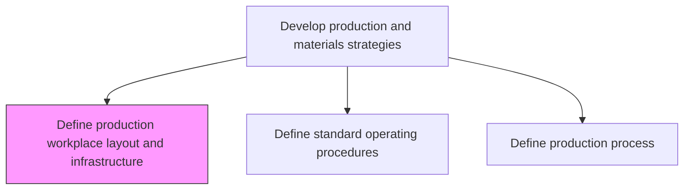
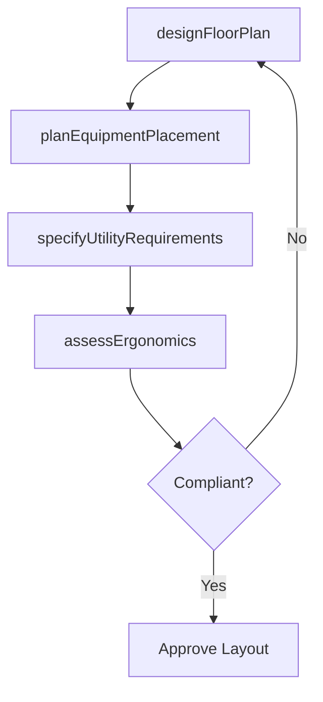

# Define production workplace layout and infrastructure

> Business-as-Code definition for production workplace layout and infrastructure planning. Models floor plan design, equipment placement, utility provisioning, and ergonomic assessment as programmable facility configurations.

## Overview

Determining the floor plans for the processing facility that is meant for delivering finished products/services. Identify the totality of infrastructure needed for using this space in the manufacturing process, including machinery, factory floors, offices, and furniture.

## Process Hierarchy



## GraphDL

```yaml
define:
  object: Production Workplace Layout And Infrastructure
  actor: FacilitiesEngineer
  result: FacilityLayout
```

## Actions

| Action | Description |
|--------|-------------|
| designFloorPlan | Create facility floor plan with production zones and material flow |
| planEquipmentPlacement | Determine optimal positioning of machinery and workstations |
| specifyUtilityRequirements | Define electrical, HVAC, plumbing, and compressed air needs |
| assessErgonomics | Evaluate workplace design for operator safety and efficiency |

## Events

| Event | Description |
|-------|-------------|
| floorPlanDesigned | Facility layout documented with zone definitions |
| equipmentPlacementPlanned | Machine and workstation positions finalized |
| utilityRequirementsSpecified | Infrastructure utility needs documented |
| ergonomicsAssessed | Workplace ergonomic review completed |

## Searches

| Search | Description |
|--------|-------------|
| getFacilityLayout | Retrieve floor plan and zone configuration by facility |
| getEquipmentPlacements | Query equipment positions and space allocations |
| getUtilityRequirements | List infrastructure utility specifications by zone |

## Process Flow



## RACI Matrix

| Activity | Responsible | Accountable | Consulted | Informed |
|----------|-------------|-------------|-----------|----------|
| designFloorPlan | FacilitiesEngineer | ManufacturingDirector | Production, Safety | Executive |
| planEquipmentPlacement | IndustrialEngineer | FacilitiesEngineer | Maintenance, Production | Finance |

## Related Processes

| Process | Relationship |
|---------|-------------|
| 4.1.1.7 Define production process | Upstream - process flow drives layout requirements |
| 4.1.1.5 Define capacities | Upstream - capacity needs inform space planning |
| 4.3.2 Produce/Assemble product | Downstream - production operates within defined layout |

## Related Departments

| Department | Role |
|-----------|------|
| Facilities Engineering | Primary owner of layout design and infrastructure |
| Manufacturing Engineering | Provides equipment specifications and flow requirements |
| EHS | Reviews safety compliance and ergonomic standards |

## Related Occupations

| Occupation | Involvement |
|-----------|-------------|
| Facilities Engineer | Layout design and infrastructure specification |
| Industrial Engineer | Equipment placement optimization |

## KPIs

| KPI | Description | Unit |
|-----|-------------|------|
| Space Utilization | Percentage of facility space productively utilized | % |
| Material Flow Efficiency | Distance traveled by materials through production | Meters |
| Ergonomic Compliance Rate | Percentage of workstations meeting ergonomic standards | % |

## Usage

```typescript
import { defineProductionWorkplaceLayoutAndInfrastructure } from '@headlessly/define-production-workplace-layout-and-infrastructure'

const client = defineProductionWorkplaceLayoutAndInfrastructure()

// Design floor plan
const layout = await client.designFloorPlan({
  facility: 'PLANT-EAST',
  totalArea: 50000,
  zones: ['receiving', 'raw-materials', 'production', 'assembly', 'qa', 'shipping'],
  materialFlowPattern: 'U-shaped'
})
```
