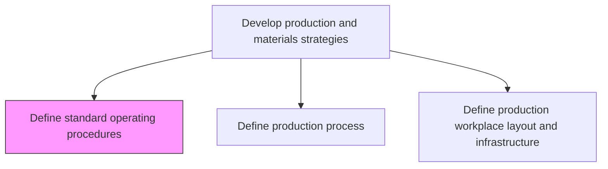
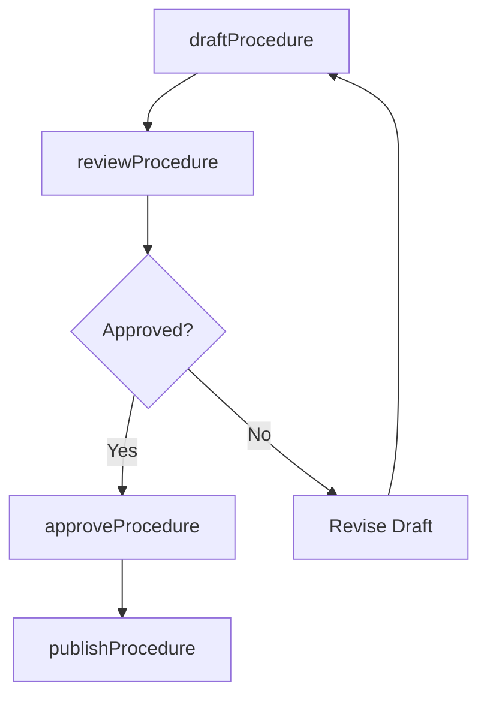

# Define standard operating procedures

> Business-as-Code definition for standard operating procedure creation. Models step-by-step work instructions, revision control, compliance mapping, and operator training linkage as programmable procedure documents.

## Overview

Establishing or prescribing methods to be followed routinely for the performance of designated operations or in designated situations. This may include step-by-step instructions to help workers carry out complex routine operations. The goal is to improve efficiency, quality, and uniformity of performance, while reducing miscommunication, failure, or rework.

## Process Hierarchy



## GraphDL

```yaml
define:
  object: Standard Operating Procedures
  actor: QualitySystemsManager
  result: StandardOperatingProcedure
```

## Actions

| Action | Description |
|--------|-------------|
| draftProcedure | Write step-by-step work instructions for designated operations |
| reviewProcedure | Conduct peer and management review of drafted SOPs |
| approveProcedure | Obtain formal approval and sign-off from authorized personnel |
| publishProcedure | Distribute approved SOPs and update document control system |

## Events

| Event | Description |
|-------|-------------|
| procedureDrafted | SOP document authored and submitted for review |
| procedureReviewed | Peer and management review completed with feedback |
| procedureApproved | SOP formally approved and signed off |
| procedurePublished | Approved SOP distributed and registered in document control |

## Searches

| Search | Description |
|--------|-------------|
| getSOPsByProcess | Retrieve SOPs for a specific production process or work center |
| getSOPRevisionHistory | Query revision history and change log for an SOP |
| getSOPComplianceStatus | Check SOP compliance status by department or facility |

## Process Flow



## RACI Matrix

| Activity | Responsible | Accountable | Consulted | Informed |
|----------|-------------|-------------|-----------|----------|
| draftProcedure | ProcessEngineer | QualitySystemsManager | Operators, Safety | Production |
| reviewProcedure | QASpecialist | QualitySystemsManager | ProcessEngineering, EHS | Management |
| publishProcedure | DocumentController | QualitySystemsManager | Training, IT | AllDepartments |

## Related Processes

| Process | Relationship |
|---------|-------------|
| 4.1.1.7 Define production process | Upstream - process definitions drive SOP content |
| 4.1.9 Develop quality standards and procedures | Parallel - quality standards inform SOP requirements |
| 4.3.2 Produce/Assemble product | Downstream - operators follow SOPs during production |

## Related Departments

| Department | Role |
|-----------|------|
| Quality Systems | Primary owner of SOP creation and document control |
| Manufacturing Engineering | Provides technical content for production SOPs |
| Training | Links SOPs to operator training programs |

## Related Occupations

| Occupation | Involvement |
|-----------|-------------|
| Quality Systems Manager | SOP program ownership and compliance |
| Process Engineer | Technical SOP authoring |
| Document Controller | Version control and distribution |

## KPIs

| KPI | Description | Unit |
|-----|-------------|------|
| SOP Coverage | Percentage of production processes with current SOPs | % |
| SOP Currency Rate | Percentage of SOPs reviewed within their review cycle | % |
| SOP Deviation Rate | Number of documented deviations from SOPs per period | Count |

## Usage

```typescript
import { defineStandardOperatingProcedures } from '@headlessly/define-standard-operating-procedures'

const client = defineStandardOperatingProcedures()

// Draft a new SOP
const sop = await client.draftProcedure({
  processId: 'PROC-ASSEMBLY-001',
  title: 'PCB Assembly Standard Operating Procedure',
  version: '1.0',
  steps: ['component-placement', 'soldering', 'inspection', 'testing'],
  safetyRequirements: ['esd-protection', 'ventilation']
})
```
