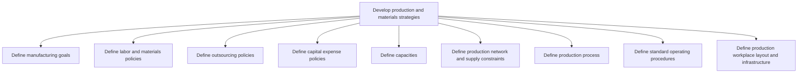
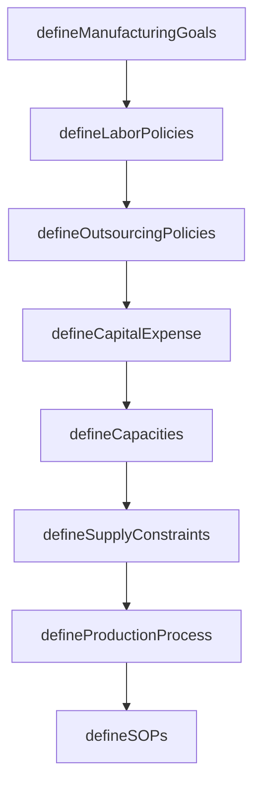

# Develop production and materials strategies

> Business-as-Code definition for production and materials strategy development. Models manufacturing goal setting, capacity planning, labor and outsourcing policies, and facility layout as programmable workflows.

## Overview

Creating strategies for production processes, as well as the process of managing materials. Define production and supply constraints. Design a blueprint of the workplace. Establish rules and regulations regarding the employees, outsourcing of services, and the expenditure to be incurred on the manufacturing capital.

## Process Hierarchy



## GraphDL

```yaml
develop:
  object: Production And Materials Strategies
  actor: ManufacturingStrategist
  result: ProductionStrategy
```

## Actions

| Action | Description |
|--------|-------------|
| defineManufacturingGoals | Set quantifiable production objectives by segment |
| defineLaborPolicies | Establish workforce rules including shifts and skill requirements |
| defineOutsourcingPolicies | Set guidelines for contracting production to third parties |
| defineCapitalExpense | Create policies for manufacturing equipment investment |
| defineCapacities | Outline production and processing capacity limits |
| defineSupplyConstraints | Map production network limitations and supply bottlenecks |
| defineProductionProcess | Document manufacturing process flows and work instructions |
| defineSOPs | Establish standard operating procedures for production |

## Events

| Event | Description |
|-------|-------------|
| manufacturingGoalsDefined | Production objectives established and approved |
| laborPoliciesSet | Workforce and materials policies documented |
| outsourcingPoliciesSet | Third-party manufacturing guidelines finalized |
| capacitiesDefined | Production capacity limits documented |
| supplyConstraintsMapped | Network constraints and bottlenecks identified |
| productionProcessDefined | Manufacturing process flows documented |
| sopsEstablished | Standard operating procedures published |

## Searches

| Search | Description |
|--------|-------------|
| getCapacityProfile | Retrieve current production capacity by line or facility |
| findPolicyDocuments | Query production and materials policy documents |
| getOutsourcingContracts | List active outsourcing agreements and their terms |
| getCapitalBudget | Retrieve capital expense allocations and utilization |

## Process Flow



## RACI Matrix

| Activity | Responsible | Accountable | Consulted | Informed |
|----------|-------------|-------------|-----------|----------|
| defineManufacturingGoals | ManufacturingStrategist | VP Operations | Sales, Finance | Executive |
| defineLaborPolicies | HRBusinessPartner | VP Manufacturing | Legal, UnionRep | Finance |
| defineCapacities | ProductionEngineer | PlantManager | SupplyChain | Finance |
| defineProductionProcess | ProcessEngineer | VP Manufacturing | QA, Maintenance | Operations |

## Sub-Processes

| ID | Name | Description |
|----|------|-------------|
| 4.1.1.1 | Define manufacturing goals | Creating quantifiable strategic objectives for each manufacturing segment in conjunction with sales  |
| 4.1.1.2 | Define labor and materials policies | Setting up internal rules and regulations regarding the employees and the materials. |
| 4.1.1.3 | Define outsourcing policies | Creating rules and regulations regarding contracting out of a business process to another party in o |
| 4.1.1.4 | Define capital expense policies | Designing rules and regulations pertaining to the expenditure incurred in acquiring or upgrading the |
| 4.1.1.5 | Define capacities | Outlining the manufacturing and processing capacities of the organization. Delineate the capabilitie |
| 4.1.1.6 | Define production network and supply constraints | Defining limitations in the ability of the organization's supply chain to deliver a new stock, and c |
| 4.1.1.7 | Define production process | Outlining the scheme of processing inventory into finished products/services. This includes the use  |
| 4.1.1.8 | Define standard operating procedures | Establishing or prescribing methods to be followed routinely for the performance of designated opera |
| 4.1.1.9 | Define production workplace layout and infrastructure | Determining the floor plans for the processing facility that is meant for delivering finished produc |

## Related Processes

| Process | Relationship |
|---------|-------------|
| 4.1.2 Plan sales and operations | Downstream - production strategy informs S&OP |
| 4.1.3 Manage demand for products | Parallel - demand signals shape capacity decisions |
| 4.3 Produce/Assemble/Test product | Downstream - strategies guide manufacturing execution |

## Related Departments

| Department | Role |
|-----------|------|
| Manufacturing | Primary owner of production strategy and goals |
| Engineering | Provides process design and facility layout expertise |
| Finance | Approves capital expenditure and outsourcing budgets |
| Human Resources | Defines labor policies and workforce requirements |

## Related Occupations

| Occupation | Involvement |
|-----------|-------------|
| Manufacturing Strategist | Production goal setting and strategy development |
| Process Engineer | Production process and facility design |
| Capacity Planner | Capacity modeling and constraint analysis |

## KPIs

| KPI | Description | Unit |
|-----|-------------|------|
| Strategy Completion Rate | Percentage of strategy milestones achieved on schedule | % |
| Capacity Utilization Target | Planned versus actual capacity utilization | % |
| Capital Efficiency | Return on manufacturing capital investment | Ratio |
| SOP Compliance | Percentage of production activities following SOPs | % |

## Usage

```typescript
import { developProductionAndMaterialsStrategies } from '@headlessly/develop-production-and-materials-strategies'

const client = developProductionAndMaterialsStrategies()

// Define manufacturing goals for a product segment
const goals = await client.defineManufacturingGoals({
  segment: 'automotive-components',
  targetOutput: 50000,
  period: 'monthly',
  qualityTarget: 99.5
})

// Define production capacity
const capacity = await client.defineCapacities({
  facility: 'plant-midwest',
  lines: ['line-A', 'line-B', 'line-C'],
  shiftsPerDay: 2,
  maxThroughput: 2000
})
```
