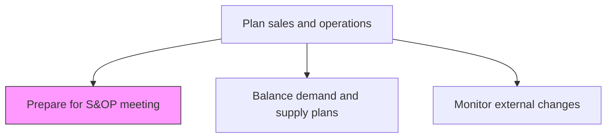
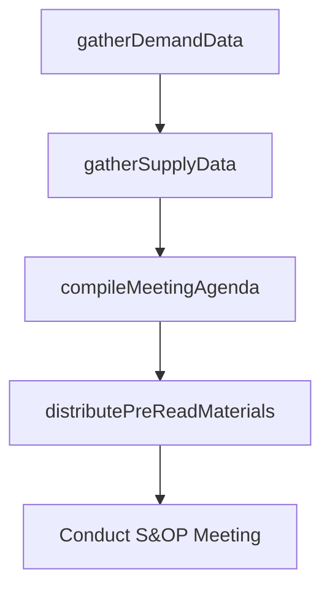

# Prepare for sales and operations planning (S&OP) meeting

> Business-as-Code definition for S&OP meeting preparation. Models data gathering, agenda creation, pre-meeting analysis, and stakeholder coordination as programmable preparation workflows.

## Overview

Gathering demand forecasts, supply plans, financial data, and performance metrics to compile the agenda and supporting materials for the monthly sales and operations planning meeting. Ensure all cross-functional stakeholders are prepared with current data and pre-analyzed scenarios.

## Process Hierarchy



## GraphDL

```yaml
prepare:
  object: For Sales And Operations Planning (S&OP) Meeting
  actor: SOPCoordinator
  result: SOPMeetingPackage
```

## Actions

| Action | Description |
|--------|-------------|
| gatherDemandData | Compile latest demand forecasts and sales pipeline data |
| gatherSupplyData | Collect current supply capacity, inventory, and production status |
| compileMeetingAgenda | Create structured agenda with key decision points |
| distributePreReadMaterials | Send meeting package to all stakeholders before the session |

## Events

| Event | Description |
|-------|-------------|
| demandDataGathered | Demand forecasts and pipeline data compiled |
| supplyDataGathered | Supply and capacity data collected and summarized |
| meetingAgendaCompiled | S&OP meeting agenda finalized and distributed |
| preReadMaterialsDistributed | Meeting materials sent to all participants |

## Searches

| Search | Description |
|--------|-------------|
| getMeetingAgenda | Retrieve S&OP meeting agenda for a specific period |
| getPreReadMaterials | Query pre-meeting data packages by topic or stakeholder |
| getMeetingHistory | Retrieve past S&OP meeting minutes and decisions |

## Process Flow



## RACI Matrix

| Activity | Responsible | Accountable | Consulted | Informed |
|----------|-------------|-------------|-----------|----------|
| gatherDemandData | DemandPlanner | SOPCoordinator | Sales | Finance |
| compileMeetingAgenda | SOPCoordinator | VPSupplyChain | AllFunctions | Executive |

## Related Processes

| Process | Relationship |
|---------|-------------|
| 4.1.2.2 Balance demand and supply plans | Downstream - meeting decisions drive plan balancing |
| 4.1.3 Manage demand for products | Upstream - demand data feeds meeting preparation |
| 4.1.4 Create materials plan | Upstream - materials data contributes to supply review |

## Related Departments

| Department | Role |
|-----------|------|
| Supply Chain Planning | Coordinates meeting preparation and data compilation |
| Sales | Provides demand forecasts and pipeline updates |
| Finance | Supplies financial projections and variance analysis |

## Related Occupations

| Occupation | Involvement |
|-----------|-------------|
| S&OP Coordinator | Meeting preparation and facilitation |
| Demand Planner | Demand data compilation |

## KPIs

| KPI | Description | Unit |
|-----|-------------|------|
| Meeting Preparation Timeliness | Percentage of pre-read materials distributed on time | % |
| Stakeholder Attendance Rate | Percentage of required attendees present at S&OP meeting | % |
| Data Completeness | Percentage of required data elements available for meeting | % |

## Usage

```typescript
import { prepareForSalesAndOperationsPlanningMeeting } from '@headlessly/prepare-for-sales-and-operations-planning-sop-meeting'

const client = prepareForSalesAndOperationsPlanningMeeting()

// Compile meeting agenda
const agenda = await client.compileMeetingAgenda({
  period: 'June-2025',
  topics: ['demand-review', 'supply-review', 'financial-reconciliation', 'new-product-launch'],
  distributionDate: '2025-05-28'
})
```
