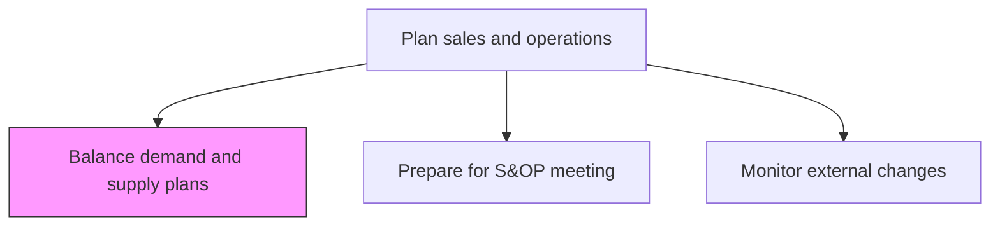
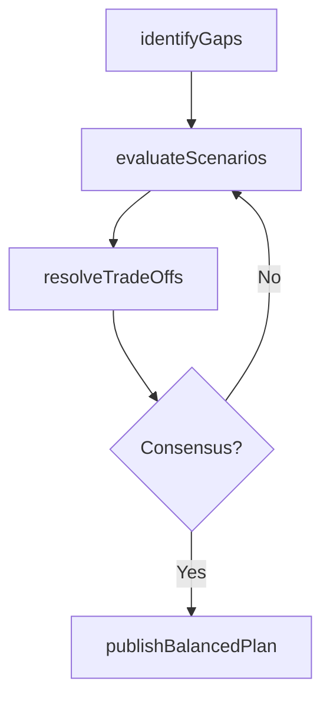

# Balance demand and supply plans

> Business-as-Code definition for demand and supply plan balancing. Models gap analysis, scenario evaluation, trade-off decisions, and consensus plan generation as programmable balancing workflows.

## Overview

Reconciling demand forecasts with supply capabilities to identify gaps, evaluate trade-offs, and arrive at a feasible operating plan. Adjust production schedules, inventory targets, and procurement plans to align available supply with projected demand across all product families.

## Process Hierarchy



## GraphDL

```yaml
balance:
  object: Demand And Supply Plans
  actor: SupplyChainPlanner
  result: BalancedPlan
```

## Actions

| Action | Description |
|--------|-------------|
| identifyGaps | Compare demand forecast against supply capacity to find imbalances |
| evaluateScenarios | Model alternative plans to resolve demand-supply gaps |
| resolveTradeOffs | Make trade-off decisions between service level, cost, and inventory |
| publishBalancedPlan | Distribute the agreed demand-supply plan to execution teams |

## Events

| Event | Description |
|-------|-------------|
| gapsIdentified | Demand-supply imbalances documented with root causes |
| scenariosEvaluated | Alternative resolution scenarios analyzed and compared |
| tradeOffsResolved | Cross-functional agreement reached on plan adjustments |
| balancedPlanPublished | Consensus plan distributed to production and procurement |

## Searches

| Search | Description |
|--------|-------------|
| getGapAnalysis | Retrieve demand-supply gap details by product family or period |
| getScenarioComparison | Query scenario analysis results and trade-off impacts |
| getBalancedPlan | Retrieve the approved balanced plan by period |

## Process Flow



## RACI Matrix

| Activity | Responsible | Accountable | Consulted | Informed |
|----------|-------------|-------------|-----------|----------|
| identifyGaps | SupplyChainPlanner | VPSupplyChain | DemandPlanning, Production | Finance |
| resolveTradeOffs | SOPCoordinator | VPSupplyChain | Sales, Manufacturing, Finance | Executive |

## Related Processes

| Process | Relationship |
|---------|-------------|
| 4.1.2.1 Prepare for S&OP meeting | Upstream - meeting data feeds balancing process |
| 4.1.3 Manage demand for products | Upstream - demand forecasts provide one side of the balance |
| 4.1.5 Create and manage master production schedule | Downstream - balanced plan drives MPS creation |

## Related Departments

| Department | Role |
|-----------|------|
| Supply Chain Planning | Leads demand-supply balancing and scenario analysis |
| Sales | Provides demand priorities and customer commitments |
| Manufacturing | Confirms production capacity and constraints |

## Related Occupations

| Occupation | Involvement |
|-----------|-------------|
| Supply Chain Planner | Gap analysis and scenario modeling |
| S&OP Coordinator | Consensus facilitation |

## KPIs

| KPI | Description | Unit |
|-----|-------------|------|
| Plan Balance Accuracy | Variance between balanced plan and actual execution | % |
| Demand-Supply Gap | Aggregate unresolved demand-supply gap at plan close | Units |
| Scenario Resolution Time | Time from gap identification to consensus resolution | Days |

## Usage

```typescript
import { balanceDemandAndSupplyPlans } from '@headlessly/balance-demand-and-supply-plans'

const client = balanceDemandAndSupplyPlans()

// Identify gaps
const gaps = await client.identifyGaps({
  period: 'Q3-2025',
  productFamilies: ['electronics', 'appliances'],
  tolerancePercent: 5
})
```
