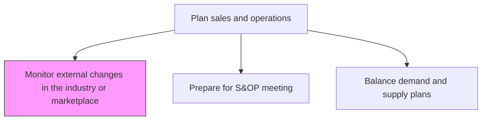
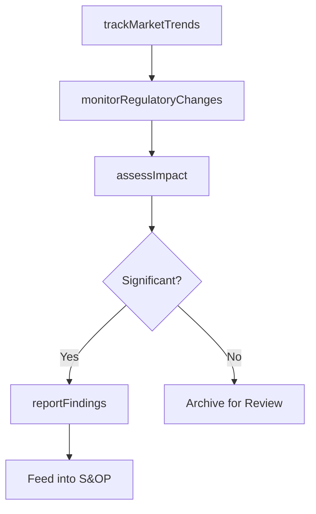

# Monitor external changes in the industry or marketplace

> Business-as-Code definition for external market and industry change monitoring. Models market intelligence gathering, trend analysis, regulatory tracking, and impact assessment as programmable surveillance workflows.

## Overview

Tracking shifts in the external business environment that may impact supply chain operations, including changes in market demand patterns, commodity pricing, competitive dynamics, regulatory requirements, and macroeconomic conditions. Feed insights into the S&OP process to proactively adjust plans.

## Process Hierarchy



## GraphDL

```yaml
monitor:
  object: External Changes In Industry Or Marketplace
  actor: MarketIntelligenceAnalyst
  result: MarketChangeReport
```

## Actions

| Action | Description |
|--------|-------------|
| trackMarketTrends | Monitor market demand shifts, pricing, and competitive activity |
| monitorRegulatoryChanges | Track regulatory and trade policy changes affecting operations |
| assessImpact | Evaluate how external changes affect demand, supply, or costs |
| reportFindings | Compile and distribute market intelligence to planning teams |

## Events

| Event | Description |
|-------|-------------|
| marketTrendsTracked | Market data collected and trends identified |
| regulatoryChangesMonitored | Regulatory shifts documented and assessed |
| impactAssessed | Business impact of external changes quantified |
| findingsReported | Market intelligence report distributed to stakeholders |

## Searches

| Search | Description |
|--------|-------------|
| getMarketTrends | Retrieve market trend data by industry, region, or commodity |
| getRegulatoryChanges | Query regulatory changes by jurisdiction or category |
| getImpactAssessments | Retrieve impact analyses for identified external changes |

## Process Flow



## RACI Matrix

| Activity | Responsible | Accountable | Consulted | Informed |
|----------|-------------|-------------|-----------|----------|
| trackMarketTrends | MarketIntelligenceAnalyst | VPSupplyChain | Sales, Strategy | Planning |
| assessImpact | SupplyChainAnalyst | VPSupplyChain | Finance, Procurement | Executive |

## Related Processes

| Process | Relationship |
|---------|-------------|
| 4.1.2.1 Prepare for S&OP meeting | Downstream - external insights inform meeting agenda |
| 4.1.2.2 Balance demand and supply plans | Downstream - market changes affect plan assumptions |
| 1.1.1 Assess the external environment | Parallel - strategic environmental scanning |

## Related Departments

| Department | Role |
|-----------|------|
| Market Intelligence | Primary owner of external monitoring |
| Supply Chain Planning | Consumes insights for plan adjustments |
| Procurement | Tracks commodity and supplier market changes |

## Related Occupations

| Occupation | Involvement |
|-----------|-------------|
| Market Intelligence Analyst | External data collection and analysis |
| Supply Chain Analyst | Impact assessment and plan adjustment |

## KPIs

| KPI | Description | Unit |
|-----|-------------|------|
| Intelligence Timeliness | Average time from external event to internal awareness | Days |
| Impact Prediction Accuracy | Accuracy of predicted versus actual business impact | % |
| Coverage Breadth | Number of external factors actively monitored | Count |

## Usage

```typescript
import { monitorExternalChangesInIndustryOrMarketplace } from '@headlessly/monitor-external-changes-in-industry-or-marketplace'

const client = monitorExternalChangesInIndustryOrMarketplace()

// Track market trends
const trends = await client.trackMarketTrends({
  industries: ['semiconductor', 'automotive'],
  dataPoints: ['commodity-prices', 'demand-indices', 'trade-tariffs'],
  period: 'Q2-2025'
})
```
