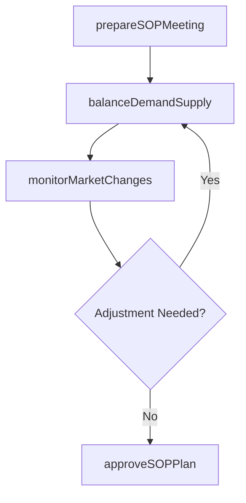

# Plan sales and operations

> Business-as-Code definition for sales and operations planning (S&OP). Models cross-functional demand-supply balancing, S&OP meeting preparation, and market monitoring as programmable workflows.

## Overview

Aligning sales forecasts with operational capacity through a structured planning cadence. Prepare data and analysis for S&OP review meetings, balance demand and supply plans to reach consensus, and continuously monitor external market and industry changes that may impact the plan.

## Process Hierarchy

```mermaid
graph TD
    A[Plan sales and operations]
    A --> B[Prepare for sales and operations planning (S&OP) meeting]
    A --> C[Balance demand and supply plans]
    A --> D[Monitor external changes in the industry or marketplace]
```

## GraphDL

```yaml
plan:
  object: Sales And Operations
  actor: SalesAndOperationsPlanner
  result: IntegratedSOPPlan
```

## Actions

| Action | Description |
|--------|-------------|
| prepareSOPMeeting | Gather demand, supply, and financial data for S&OP review |
| balanceDemandSupply | Reconcile demand forecast with supply capacity constraints |
| monitorMarketChanges | Track industry trends, competitor actions, and economic shifts |
| approveSOPPlan | Obtain executive sign-off on integrated demand-supply plan |

## Events

| Event | Description |
|-------|-------------|
| sopMeetingPrepared | S&OP meeting data package assembled and distributed |
| demandSupplyBalanced | Demand and supply plans reconciled and gaps resolved |
| marketChangeDetected | Significant external market shift identified and assessed |
| sopPlanApproved | Integrated S&OP plan approved by executive team |

## Searches

| Search | Description |
|--------|-------------|
| getSOPDashboard | Retrieve S&OP summary with demand-supply gap analysis |
| findMarketAlerts | Query recent market and industry change notifications |
| getSOPHistory | Retrieve historical S&OP plans and plan-versus-actual data |

## Process Flow



## RACI Matrix

| Activity | Responsible | Accountable | Consulted | Informed |
|----------|-------------|-------------|-----------|----------|
| prepareSOPMeeting | DemandPlanner | VP SupplyChain | Sales, Finance | Manufacturing |
| balanceDemandSupply | SupplyChainPlanner | VP Operations | Marketing, Production | Executive |
| monitorMarketChanges | MarketAnalyst | VP Strategy | Sales, Procurement | SupplyChain |

## Sub-Processes

| ID | Name | Description |
|----|------|-------------|
| 4.1.2.1 | Prepare for sales and operations planning (S&OP) meeting | Assembling demand forecasts, supply capacity data, financial projections, and market intelligence into a consolidated data package for the S&OP review cycle |
| 4.1.2.2 | Balance demand and supply plans | Reconciling demand forecast volumes with production and supply capacity to identify gaps, propose trade-offs, and build a consensus operating plan |
| 4.1.2.3 | Monitor external changes in the industry or marketplace | Tracking competitor actions, regulatory changes, commodity price shifts, and macroeconomic indicators that may require plan adjustments |

## Related Processes

| Process | Relationship |
|---------|-------------|
| 4.1.1 Develop production and materials strategies | Upstream - strategies provide planning parameters |
| 4.1.3 Manage demand for products | Parallel - demand forecasts are key S&OP input |
| 4.1.5 Create and manage master production schedule | Downstream - S&OP plan drives MPS |

## Related Departments

| Department | Role |
|-----------|------|
| Supply Chain | Leads S&OP process and demand-supply balancing |
| Sales | Provides revenue forecasts and customer commitments |
| Finance | Contributes financial targets and budget constraints |
| Manufacturing | Provides production capacity and constraint data |

## Related Occupations

| Occupation | Involvement |
|-----------|-------------|
| S&OP Planner | Meeting preparation and plan coordination |
| Demand Planner | Demand forecast development |
| Supply Chain Analyst | Demand-supply gap analysis |

## KPIs

| KPI | Description | Unit |
|-----|-------------|------|
| Plan Adherence | Percentage of S&OP plan executed as agreed | % |
| Demand-Supply Gap | Variance between forecasted demand and supply capacity | Units |
| S&OP Cycle Time | Time from data gathering to executive approval | Days |

## Usage

```typescript
import { planSalesAndOperations } from '@headlessly/plan-sales-and-operations'

const client = planSalesAndOperations()

// Prepare data for monthly S&OP meeting
const dataPackage = await client.prepareSOPMeeting({
  period: '2025-06',
  includeFinancials: true,
  horizonMonths: 18
})

// Balance demand with supply capacity
const balancedPlan = await client.balanceDemandSupply({
  demandForecastId: dataPackage.demandId,
  supplyCapacityId: dataPackage.supplyId,
  optimizationGoal: 'service-level'
})
```
