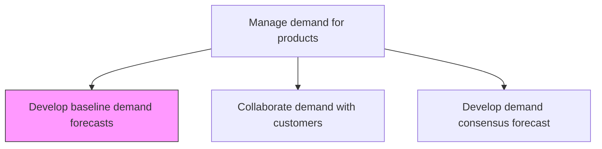
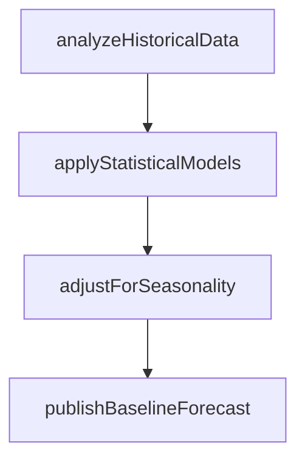

# Develop baseline demand forecasts

> Business-as-Code definition for baseline demand forecast development. Models statistical forecasting using historical data, market analysis, seasonality patterns, and trend extrapolation as programmable forecast generation.

## Overview

Identify the bedrock levels of market demand anticipated for the organization's products/services. Estimate future demand for product and services using historical data, analysis of the market environment and any externalities, etc. to create ex ante approximations.

## Process Hierarchy



## GraphDL

```yaml
develop:
  object: Baseline Demand Forecasts
  actor: DemandPlanner
  result: BaselineForecast
```

## Actions

| Action | Description |
|--------|-------------|
| analyzeHistoricalData | Process historical sales and shipment data for trend extraction |
| applyStatisticalModels | Run time-series and regression models to generate baseline |
| adjustForSeasonality | Apply seasonal factors and promotional uplift adjustments |
| publishBaselineForecast | Distribute baseline forecast for consensus review |

## Events

| Event | Description |
|-------|-------------|
| historicalDataAnalyzed | Historical demand patterns extracted and documented |
| statisticalModelsApplied | Forecasting models executed and baseline generated |
| seasonalityAdjusted | Seasonal and promotional adjustments applied |
| baselineForecastPublished | Baseline forecast distributed to stakeholders |

## Searches

| Search | Description |
|--------|-------------|
| getBaselineForecast | Retrieve baseline forecast by product, region, or period |
| getHistoricalDemand | Query historical demand data for trend analysis |
| getForecastModels | List available statistical models and their accuracy metrics |

## Process Flow



## RACI Matrix

| Activity | Responsible | Accountable | Consulted | Informed |
|----------|-------------|-------------|-----------|----------|
| analyzeHistoricalData | DemandPlanner | DemandPlanningManager | Sales, Marketing | Finance |
| applyStatisticalModels | ForecastAnalyst | DemandPlanningManager | DataScience | SupplyPlanning |

## Related Processes

| Process | Relationship |
|---------|-------------|
| 4.1.3.2 Collaborate demand with customers | Downstream - baseline informs customer collaboration |
| 4.1.3.3 Develop demand consensus forecast | Downstream - baseline contributes to consensus |
| 4.1.3.7 Measure demand forecast accuracy | Downstream - baseline accuracy measured |

## Related Departments

| Department | Role |
|-----------|------|
| Demand Planning | Primary owner of baseline forecast creation |
| Sales | Provides sales history and pipeline data |
| Data Science | Supports statistical model selection and tuning |

## Related Occupations

| Occupation | Involvement |
|-----------|-------------|
| Demand Planner | Forecast creation and analysis |
| Forecast Analyst | Statistical model execution |

## KPIs

| KPI | Description | Unit |
|-----|-------------|------|
| Baseline Forecast Accuracy | Mean absolute percentage error of baseline | % |
| Forecast Bias | Systematic over or under-forecasting tendency | % |
| Model Fit Score | Statistical goodness-of-fit for forecasting models | R-squared |

## Usage

```typescript
import { developBaselineDemandForecasts } from '@headlessly/develop-baseline-demand-forecasts'

const client = developBaselineDemandForecasts()

// Apply statistical models
const forecast = await client.applyStatisticalModels({
  productFamily: 'Consumer Electronics',
  horizon: 12,
  granularity: 'monthly',
  models: ['exponential-smoothing', 'arima']
})
```
