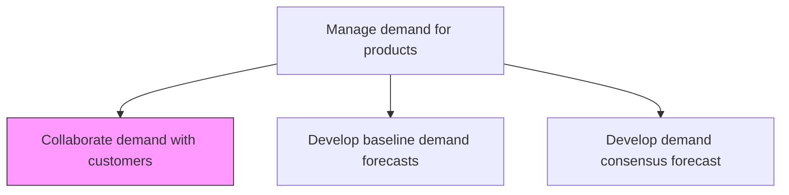
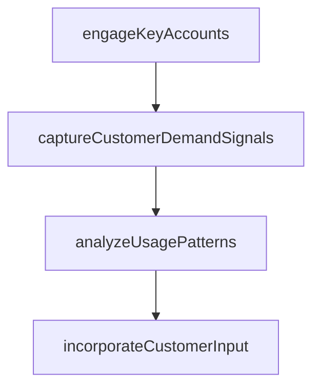

# Collaborate demand with customers

> Business-as-Code definition for customer demand collaboration. Models customer engagement, demand signal capture, usage pattern analysis, and collaborative forecast refinement as programmable workflows.

## Overview

Working closely with the organization's customers to understand their drives and behavior, with the objective of estimating future demand. Reach out to customers through various means to understand their behavior patterns, usage elasticity, and degree of variability--and ultimately determine demand for each offering.

## Process Hierarchy



## GraphDL

```yaml
collaborate:
  object: Demand With Customers
  actor: AccountManager
  result: CustomerDemandSignal
```

## Actions

| Action | Description |
|--------|-------------|
| engageKeyAccounts | Schedule demand collaboration sessions with strategic customers |
| captureCustomerDemandSignals | Collect customer purchase plans, forecasts, and commitments |
| analyzeUsagePatterns | Study customer consumption patterns and demand variability |
| incorporateCustomerInput | Integrate customer-provided demand signals into forecast models |

## Events

| Event | Description |
|-------|-------------|
| keyAccountsEngaged | Demand collaboration meetings completed with key customers |
| customerDemandSignalsCaptured | Customer purchase plans and commitments recorded |
| usagePatternsAnalyzed | Customer consumption behavior documented |
| customerInputIncorporated | Customer demand signals integrated into forecast |

## Searches

| Search | Description |
|--------|-------------|
| getCustomerDemandSignals | Retrieve customer-provided demand data by account or product |
| getCollaborationHistory | Query past demand collaboration sessions and outcomes |
| getUsagePatterns | Retrieve customer consumption patterns and trends |

## Process Flow



## RACI Matrix

| Activity | Responsible | Accountable | Consulted | Informed |
|----------|-------------|-------------|-----------|----------|
| engageKeyAccounts | AccountManager | DemandPlanningManager | Sales | DemandPlanning |
| captureCustomerDemandSignals | DemandPlanner | DemandPlanningManager | AccountManager | SupplyPlanning |

## Related Processes

| Process | Relationship |
|---------|-------------|
| 4.1.3.1 Develop baseline demand forecasts | Upstream - baseline provides starting point for collaboration |
| 4.1.3.3 Develop demand consensus forecast | Downstream - customer input feeds consensus |
| 3.3 Manage selling activities | Parallel - sales provides customer relationship access |

## Related Departments

| Department | Role |
|-----------|------|
| Demand Planning | Coordinates customer demand collaboration |
| Sales | Facilitates customer access and relationship management |
| Customer Success | Provides customer usage and consumption data |

## Related Occupations

| Occupation | Involvement |
|-----------|-------------|
| Account Manager | Customer engagement and relationship |
| Demand Planner | Demand signal integration |

## KPIs

| KPI | Description | Unit |
|-----|-------------|------|
| Customer Collaboration Coverage | Percentage of top accounts with active demand collaboration | % |
| Signal-to-Forecast Improvement | Accuracy improvement from customer input versus baseline | % |
| Collaboration Session Frequency | Number of demand collaboration sessions per quarter | Count |

## Usage

```typescript
import { collaborateDemandWithCustomers } from '@headlessly/collaborate-demand-with-customers'

const client = collaborateDemandWithCustomers()

// Capture customer demand signals
const signals = await client.captureCustomerDemandSignals({
  accountId: 'ACCT-5500',
  products: ['SKU-100', 'SKU-200'],
  forecastHorizon: '6-months',
  commitmentLevel: 'firm-order'
})
```
