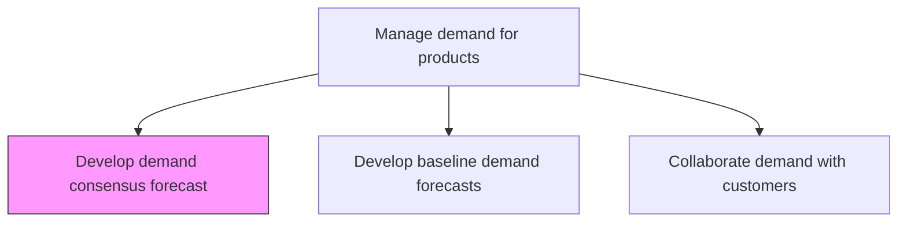
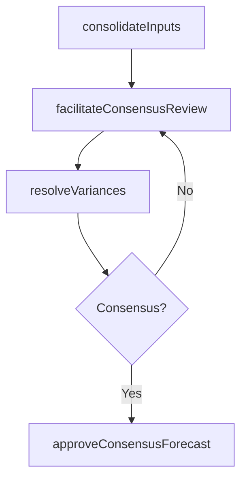

# Develop demand consensus forecast

> Business-as-Code definition for demand consensus forecast creation. Models cross-functional reconciliation of baseline, customer, and market inputs into a single agreed-upon demand plan as a programmable consensus workflow.

## Overview

Arriving at a consensus over the forecasted levels of demand for products/services. Consensus is achieved by juxtaposing decisions developed in the baseline forecast with those reached at by collaborating with customers. Enlist senior-level decision makers of the sales and marketing functions.

## Process Hierarchy



## GraphDL

```yaml
develop:
  object: Demand Consensus Forecast
  actor: DemandPlanningManager
  result: ConsensusForecast
```

## Actions

| Action | Description |
|--------|-------------|
| consolidateInputs | Merge baseline forecast, customer signals, and market intelligence |
| facilitateConsensusReview | Conduct cross-functional review to reconcile forecast inputs |
| resolveVariances | Address discrepancies between forecast sources and stakeholder views |
| approveConsensusForecast | Obtain executive sign-off on the unified demand forecast |

## Events

| Event | Description |
|-------|-------------|
| inputsConsolidated | All forecast inputs merged into comparison view |
| consensusReviewConducted | Cross-functional review meeting completed |
| variancesResolved | Forecast discrepancies reconciled across stakeholders |
| consensusForecastApproved | Unified demand forecast approved and published |

## Searches

| Search | Description |
|--------|-------------|
| getConsensusForecast | Retrieve approved consensus forecast by period or product |
| getVarianceAnalysis | Query variances between baseline, customer, and consensus forecasts |
| getConsensusHistory | Retrieve historical consensus forecasts for trend comparison |

## Process Flow



## RACI Matrix

| Activity | Responsible | Accountable | Consulted | Informed |
|----------|-------------|-------------|-----------|----------|
| consolidateInputs | DemandPlanner | DemandPlanningManager | Sales, Marketing | Finance |
| facilitateConsensusReview | DemandPlanningManager | VPSupplyChain | SalesDirector, MarketingDirector | Executive |

## Related Processes

| Process | Relationship |
|---------|-------------|
| 4.1.3.1 Develop baseline demand forecasts | Upstream - baseline provides statistical input |
| 4.1.3.2 Collaborate demand with customers | Upstream - customer signals contribute to consensus |
| 4.1.2.2 Balance demand and supply plans | Downstream - consensus demand drives S&OP balancing |

## Related Departments

| Department | Role |
|-----------|------|
| Demand Planning | Facilitates consensus process |
| Sales | Provides market judgment and customer commitments |
| Marketing | Contributes promotional and new product demand data |

## Related Occupations

| Occupation | Involvement |
|-----------|-------------|
| Demand Planning Manager | Consensus facilitation and approval |
| Demand Planner | Input consolidation and variance analysis |

## KPIs

| KPI | Description | Unit |
|-----|-------------|------|
| Consensus Forecast Accuracy | MAPE of consensus forecast versus actuals | % |
| Consensus Achievement Rate | Percentage of product families reaching consensus on schedule | % |
| Forecast Value Added | Accuracy improvement of consensus over baseline | % |

## Usage

```typescript
import { developDemandConsensusForecast } from '@headlessly/develop-demand-consensus-forecast'

const client = developDemandConsensusForecast()

// Consolidate inputs
const merged = await client.consolidateInputs({
  period: 'Q3-2025',
  sources: ['baseline', 'customer-signals', 'marketing-events'],
  productFamilies: ['electronics', 'appliances']
})
```
