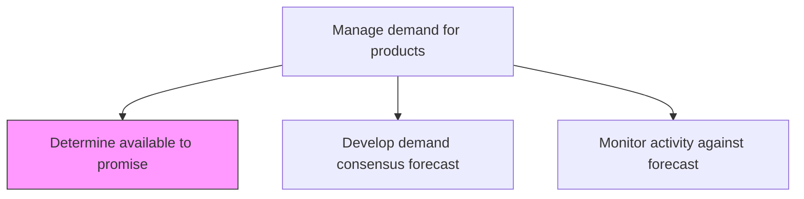
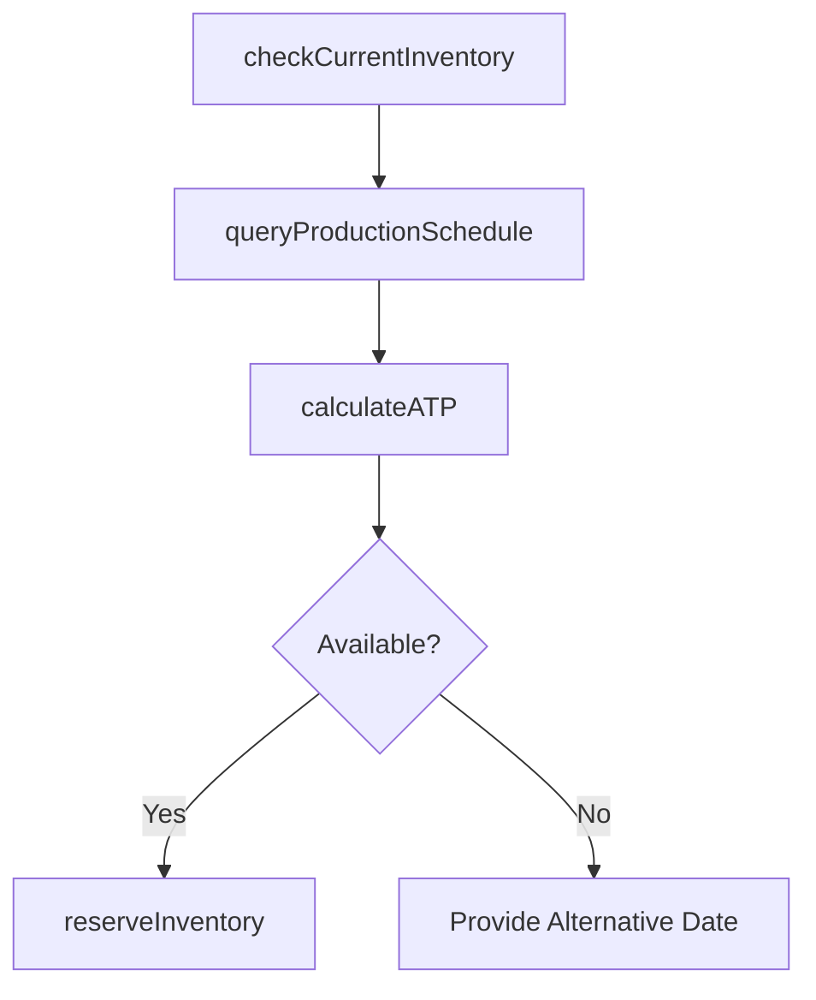

# Determine available to promise

> Business-as-Code definition for available-to-promise (ATP) determination. Models inventory availability checking, production schedule querying, and commitment allocation as programmable order promising workflows.

## Overview

Identify the volume of products/services that may be committed for delivery to fulfill sales. Figure out the amount of stock available. Forecast its volumes.

## Process Hierarchy



## GraphDL

```yaml
determine:
  object: Available To Promise
  actor: OrderManagementSpecialist
  result: ATPQuantity
```

## Actions

| Action | Description |
|--------|-------------|
| checkCurrentInventory | Query on-hand and allocated inventory across locations |
| queryProductionSchedule | Retrieve scheduled production output by product and date |
| calculateATP | Compute uncommitted inventory available for new customer orders |
| reserveInventory | Allocate ATP quantities against confirmed customer commitments |

## Events

| Event | Description |
|-------|-------------|
| inventoryChecked | Current inventory levels queried and summarized |
| productionScheduleQueried | Upcoming production output retrieved |
| atpCalculated | Available-to-promise quantities computed |
| inventoryReserved | ATP quantities reserved for customer order |

## Searches

| Search | Description |
|--------|-------------|
| getATPByProduct | Retrieve ATP quantities by product, location, and date |
| getInventoryPosition | Query current and projected inventory levels |
| getReservations | List current inventory reservations by customer or order |

## Process Flow



## RACI Matrix

| Activity | Responsible | Accountable | Consulted | Informed |
|----------|-------------|-------------|-----------|----------|
| calculateATP | OrderManagementSpecialist | DemandPlanningManager | SupplyPlanning, Warehouse | Sales |
| reserveInventory | OrderManagementSpecialist | DemandPlanningManager | Finance | Customer |

## Related Processes

| Process | Relationship |
|---------|-------------|
| 4.1.3.3 Develop demand consensus forecast | Upstream - consensus forecast drives ATP calculations |
| 4.1.5 Create and manage master production schedule | Upstream - MPS provides future production data |
| 4.4.3 Operate warehousing | Upstream - warehouse provides on-hand inventory data |

## Related Departments

| Department | Role |
|-----------|------|
| Order Management | Primary owner of ATP calculation and reservation |
| Demand Planning | Provides forecast data for projected ATP |
| Warehouse | Supplies real-time inventory data |

## Related Occupations

| Occupation | Involvement |
|-----------|-------------|
| Order Management Specialist | ATP calculation and order promising |
| Demand Planner | Forecast-based ATP projection |

## KPIs

| KPI | Description | Unit |
|-----|-------------|------|
| ATP Accuracy | Percentage of ATP promises fulfilled as committed | % |
| Order Promise Rate | Percentage of orders promised within customer-requested date | % |
| Reservation Fulfillment | Percentage of reservations converted to shipments | % |

## Usage

```typescript
import { determineAvailableToPromise } from '@headlessly/determine-available-to-promise'

const client = determineAvailableToPromise()

// Calculate ATP
const atp = await client.calculateATP({
  productId: 'SKU-3400',
  requestedDate: '2025-06-15',
  quantity: 500,
  location: 'DC-East'
})
```
