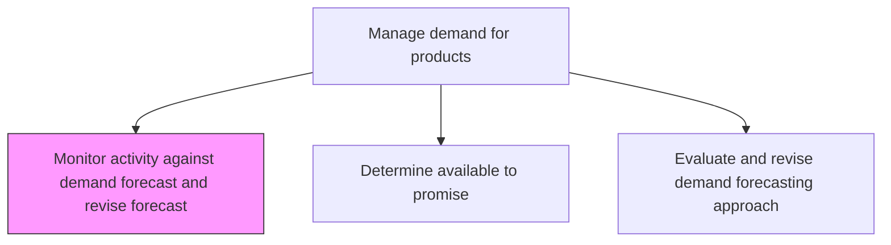
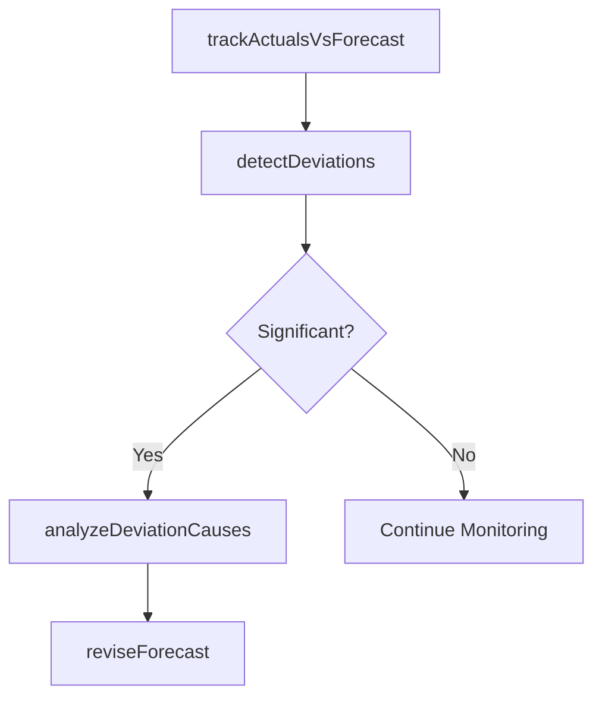

# Monitor activity against demand forecast and revise forecast

> Business-as-Code definition for demand forecast monitoring and revision. Models actual-versus-forecast tracking, deviation detection, root cause analysis, and forecast adjustment as programmable monitoring workflows.

## Overview

Picking out any activity that deviates from the forecast, and adjusting it. Closely track and study the levels of demand as they emerge. Refine the consensus forecast as needed.

## Process Hierarchy



## GraphDL

```yaml
monitor:
  object: Activity Against Demand Forecast And Revise Forecast
  actor: DemandPlanner
  result: RevisedForecast
```

## Actions

| Action | Description |
|--------|-------------|
| trackActualsVsForecast | Compare actual demand against forecasted volumes by period |
| detectDeviations | Identify significant variances requiring forecast adjustment |
| analyzeDeviationCauses | Investigate root causes of demand deviations |
| reviseForecast | Update the demand forecast to reflect emerging demand patterns |

## Events

| Event | Description |
|-------|-------------|
| actualsTracked | Actual demand compared against forecast for current period |
| deviationsDetected | Significant forecast variances identified and flagged |
| deviationCausesAnalyzed | Root causes of demand deviations documented |
| forecastRevised | Demand forecast updated with revised projections |

## Searches

| Search | Description |
|--------|-------------|
| getForecastVariance | Retrieve actual-versus-forecast variance by product or period |
| getDeviationAlerts | Query active deviation alerts above threshold |
| getRevisionHistory | Retrieve forecast revision history and change reasons |

## Process Flow



## RACI Matrix

| Activity | Responsible | Accountable | Consulted | Informed |
|----------|-------------|-------------|-----------|----------|
| trackActualsVsForecast | DemandPlanner | DemandPlanningManager | Sales | SupplyPlanning |
| reviseForecast | DemandPlanner | DemandPlanningManager | Sales, Marketing | Finance |

## Related Processes

| Process | Relationship |
|---------|-------------|
| 4.1.3.3 Develop demand consensus forecast | Upstream - consensus forecast is the reference |
| 4.1.3.6 Evaluate and revise demand forecasting approach | Downstream - persistent deviations trigger approach review |
| 4.1.3.7 Measure demand forecast accuracy | Parallel - accuracy metrics inform monitoring thresholds |

## Related Departments

| Department | Role |
|-----------|------|
| Demand Planning | Primary owner of forecast monitoring and revision |
| Sales | Provides context for demand deviations |
| Supply Planning | Adjusts supply plans based on revised forecasts |

## Related Occupations

| Occupation | Involvement |
|-----------|-------------|
| Demand Planner | Variance monitoring and forecast revision |
| Demand Planning Manager | Revision approval and escalation |

## KPIs

| KPI | Description | Unit |
|-----|-------------|------|
| Revision Frequency | Number of forecast revisions per planning cycle | Count |
| Deviation Detection Speed | Time from deviation occurrence to identification | Days |
| Post-Revision Accuracy | Forecast accuracy improvement after revisions | % |

## Usage

```typescript
import { monitorActivityAgainstDemandForecastAndReviseForecast } from '@headlessly/monitor-activity-against-demand-forecast-and-revise-forecast'

const client = monitorActivityAgainstDemandForecastAndReviseForecast()

// Track actuals vs forecast
const variance = await client.trackActualsVsForecast({
  period: 'May-2025',
  productFamily: 'Consumer Electronics',
  deviationThreshold: 10
})
```
