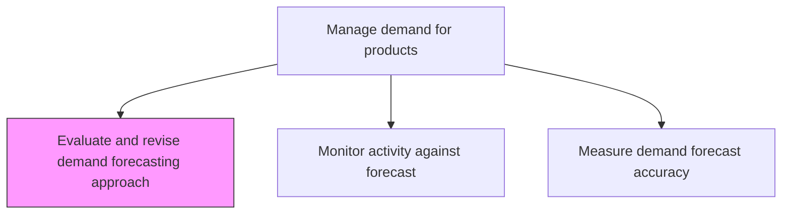
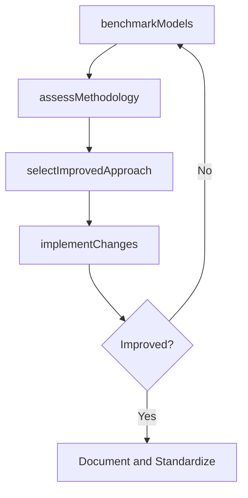

# Evaluate and revise demand forecasting approach

> Business-as-Code definition for demand forecasting methodology evaluation. Models model performance benchmarking, methodology assessment, approach refinement, and forecasting tool selection as programmable improvement workflows.

## Overview

Examining the methodology used to estimate future demand. Refine it in light of current market realities and demand.

## Process Hierarchy



## GraphDL

```yaml
evaluate:
  object: And Revise Demand Forecasting Approach
  actor: ForecastingMethodologist
  result: RevisedForecastingApproach
```

## Actions

| Action | Description |
|--------|-------------|
| benchmarkModels | Compare performance of current forecasting models against alternatives |
| assessMethodology | Evaluate the overall forecasting process for gaps and inefficiencies |
| selectImprovedApproach | Choose improved models, tools, or processes for demand forecasting |
| implementChanges | Deploy revised forecasting methodology and train users |

## Events

| Event | Description |
|-------|-------------|
| modelsBenchmarked | Forecasting model comparison completed |
| methodologyAssessed | Current forecasting approach evaluated for effectiveness |
| improvedApproachSelected | New forecasting methodology or tools chosen |
| changesImplemented | Revised methodology deployed and users trained |

## Searches

| Search | Description |
|--------|-------------|
| getModelBenchmarks | Retrieve performance comparison of forecasting models |
| getMethodologyAssessment | Query assessment results for current forecasting approach |
| getApproachHistory | Retrieve history of forecasting methodology changes |

## Process Flow



## RACI Matrix

| Activity | Responsible | Accountable | Consulted | Informed |
|----------|-------------|-------------|-----------|----------|
| benchmarkModels | ForecastingMethodologist | DemandPlanningManager | DataScience | DemandPlanners |
| implementChanges | ForecastingMethodologist | DemandPlanningManager | IT, Training | AllPlanning |

## Related Processes

| Process | Relationship |
|---------|-------------|
| 4.1.3.5 Monitor activity against demand forecast and revise forecast | Upstream - persistent variances trigger approach review |
| 4.1.3.7 Measure demand forecast accuracy | Upstream - accuracy metrics drive methodology evaluation |
| 4.1.3.1 Develop baseline demand forecasts | Downstream - revised approach improves baseline forecasts |

## Related Departments

| Department | Role |
|-----------|------|
| Demand Planning | Primary owner of forecasting methodology |
| Data Science | Supports advanced model development and benchmarking |
| IT | Deploys forecasting tools and system changes |

## Related Occupations

| Occupation | Involvement |
|-----------|-------------|
| Forecasting Methodologist | Approach evaluation and improvement |
| Data Scientist | Model benchmarking and algorithm selection |

## KPIs

| KPI | Description | Unit |
|-----|-------------|------|
| Accuracy Improvement | Percentage improvement in forecast accuracy after methodology change | % |
| Methodology Review Cadence | Frequency of forecasting approach reviews | Per Year |
| Implementation Success Rate | Percentage of methodology changes adopted successfully | % |

## Usage

```typescript
import { evaluateAndReviseDemandForecastingApproach } from '@headlessly/evaluate-and-revise-demand-forecasting-approach'

const client = evaluateAndReviseDemandForecastingApproach()

// Benchmark models
const benchmark = await client.benchmarkModels({
  currentModel: 'exponential-smoothing',
  candidates: ['arima', 'prophet', 'gradient-boosting'],
  evaluationPeriod: '24-months',
  metric: 'MAPE'
})
```
