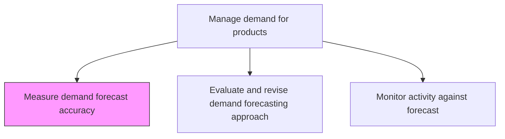
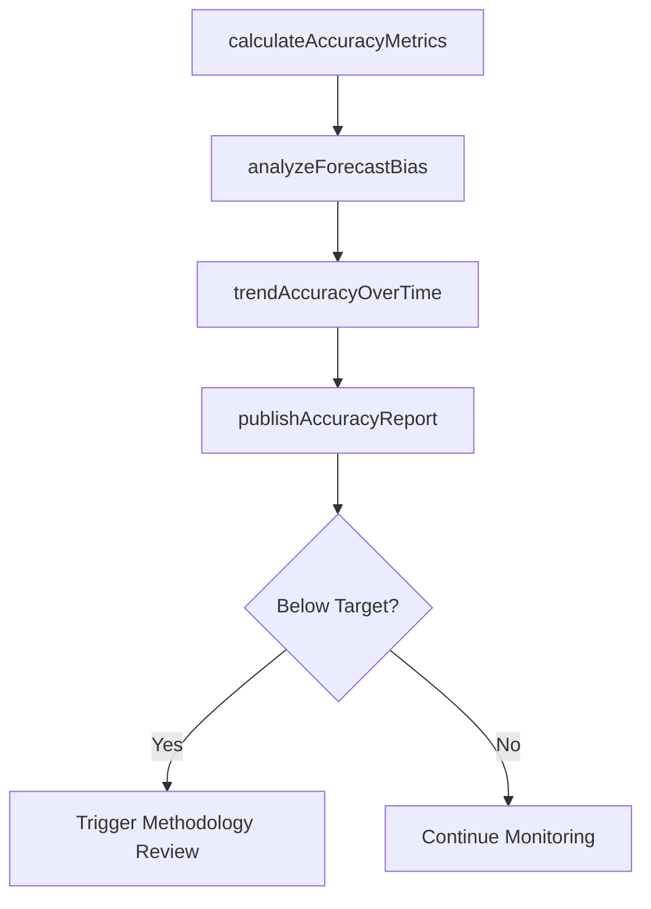

# Measure demand forecast accuracy

> Business-as-Code definition for demand forecast accuracy measurement. Models MAPE calculation, bias analysis, accuracy trending, and forecast reliability reporting as programmable measurement workflows.

## Overview

Calculating and inspecting the accuracy of demand forecasts. Use metrics to check the reliability of the forecasts created.

## Process Hierarchy



## GraphDL

```yaml
measure:
  object: Demand Forecast Accuracy
  actor: ForecastAnalyst
  result: AccuracyReport
```

## Actions

| Action | Description |
|--------|-------------|
| calculateAccuracyMetrics | Compute MAPE, MAE, bias, and other forecast accuracy statistics |
| analyzeForecastBias | Identify systematic over or under-forecasting tendencies |
| trendAccuracyOverTime | Track accuracy metrics across multiple planning periods |
| publishAccuracyReport | Distribute accuracy scorecard to planning stakeholders |

## Events

| Event | Description |
|-------|-------------|
| accuracyMetricsCalculated | Forecast accuracy statistics computed for current period |
| forecastBiasAnalyzed | Systematic bias patterns identified and documented |
| accuracyTrended | Multi-period accuracy trends generated |
| accuracyReportPublished | Accuracy scorecard distributed to stakeholders |

## Searches

| Search | Description |
|--------|-------------|
| getAccuracyMetrics | Retrieve forecast accuracy by product, family, or period |
| getBiasAnalysis | Query forecast bias trends by segment |
| getAccuracyTrends | Retrieve historical accuracy trends over multiple periods |

## Process Flow



## RACI Matrix

| Activity | Responsible | Accountable | Consulted | Informed |
|----------|-------------|-------------|-----------|----------|
| calculateAccuracyMetrics | ForecastAnalyst | DemandPlanningManager | DemandPlanners | Finance |
| publishAccuracyReport | ForecastAnalyst | DemandPlanningManager | Sales, SupplyPlanning | Executive |

## Related Processes

| Process | Relationship |
|---------|-------------|
| 4.1.3.5 Monitor activity against demand forecast and revise forecast | Upstream - actuals data feeds accuracy calculation |
| 4.1.3.6 Evaluate and revise demand forecasting approach | Downstream - accuracy results trigger approach review |
| 4.1.3.1 Develop baseline demand forecasts | Upstream - baseline forecast is subject of measurement |

## Related Departments

| Department | Role |
|-----------|------|
| Demand Planning | Primary owner of forecast accuracy measurement |
| Finance | Uses accuracy data for financial planning reliability |
| Supply Planning | Adjusts safety stock based on forecast reliability |

## Related Occupations

| Occupation | Involvement |
|-----------|-------------|
| Forecast Analyst | Accuracy calculation and reporting |
| Demand Planning Manager | Accuracy target setting and review |

## KPIs

| KPI | Description | Unit |
|-----|-------------|------|
| Mean Absolute Percentage Error | Average absolute error as percentage of actual demand | % |
| Forecast Bias | Net directional error indicating systematic tendency | % |
| Weighted Forecast Accuracy | Revenue-weighted accuracy across product portfolio | % |

## Usage

```typescript
import { measureDemandForecastAccuracy } from '@headlessly/measure-demand-forecast-accuracy'

const client = measureDemandForecastAccuracy()

// Calculate accuracy metrics
const accuracy = await client.calculateAccuracyMetrics({
  period: 'May-2025',
  granularity: 'SKU',
  metrics: ['MAPE', 'MAE', 'bias'],
  productFamily: 'Consumer Electronics'
})
```
