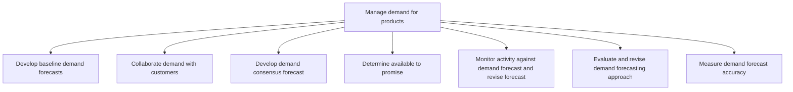
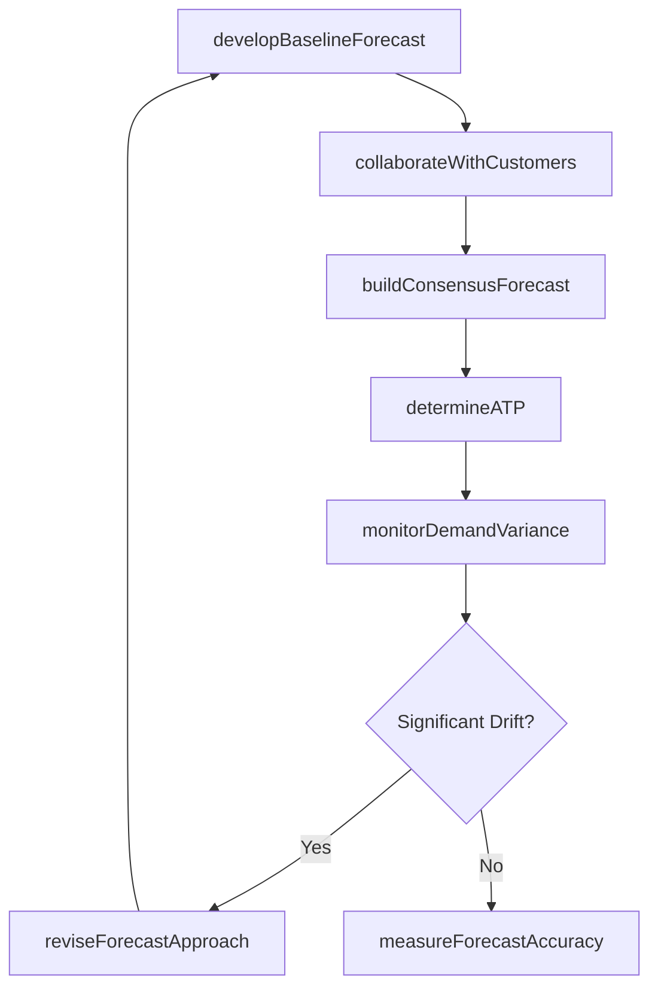

# Manage demand for products

> Business-as-Code definition for product demand management. Models baseline forecasting, customer collaboration, consensus building, available-to-promise calculation, and forecast accuracy measurement as programmable workflows.

## Overview

Forecasting demand for products using secondary research and customer feedback. Refine these forecasts. Inspect the approach used in creating forecasts, and determine its accuracy.

## Process Hierarchy



## GraphDL

```yaml
manage:
  object: Demand For Products
  actor: DemandPlanner
  result: DemandForecast
```

## Actions

| Action | Description |
|--------|-------------|
| developBaselineForecast | Generate statistical demand forecast from historical data |
| collaborateWithCustomers | Gather customer demand signals and purchase commitments |
| buildConsensusForecast | Reconcile statistical and customer inputs into consensus view |
| determineATP | Calculate available-to-promise quantities for sales commitments |
| monitorDemandVariance | Track actual demand against forecast and flag deviations |
| reviseForecastApproach | Evaluate and improve forecasting methodology |
| measureForecastAccuracy | Calculate forecast error metrics and accuracy KPIs |

## Events

| Event | Description |
|-------|-------------|
| baselineForecastCreated | Statistical demand forecast generated |
| customerDemandCollaborated | Customer demand signals incorporated into forecast |
| consensusForecastApproved | Cross-functional demand consensus reached |
| atpCalculated | Available-to-promise quantities determined |
| demandVarianceDetected | Significant deviation from forecast identified |
| forecastApproachRevised | Forecasting methodology updated and validated |
| forecastAccuracyMeasured | Forecast accuracy metrics calculated and reported |

## Searches

| Search | Description |
|--------|-------------|
| getDemandForecast | Retrieve demand forecast by product, region, or channel |
| getATPQuantity | Query available-to-promise by product and date |
| getForecastAccuracy | Retrieve forecast accuracy metrics over time |
| findDemandVariances | Identify products with significant forecast deviations |

## Process Flow



## RACI Matrix

| Activity | Responsible | Accountable | Consulted | Informed |
|----------|-------------|-------------|-----------|----------|
| developBaselineForecast | DemandPlanner | VP SupplyChain | Sales, Marketing | Finance |
| collaborateWithCustomers | SalesPlanner | VP Sales | AccountManagers | DemandPlanning |
| buildConsensusForecast | DemandPlanner | VP SupplyChain | Sales, Operations | Executive |
| determineATP | SupplyPlanner | VP Operations | Sales, Warehouse | CustomerService |
| measureForecastAccuracy | DemandAnalyst | VP SupplyChain | Finance | Executive |

## Sub-Processes

| ID | Name | Description |
|----|------|-------------|
| 4.1.3.1 | Develop baseline demand forecasts | Identify the bedrock levels of market demand anticipated for the organization's products/services. E |
| 4.1.3.2 | Collaborate demand with customers | Working closely with the organization's customers to understand their drives and behavior, with the  |
| 4.1.3.3 | Develop demand consensus forecast | Arriving at a consensus over the forecasted levels of demand for products/services. Consensus is ach |
| 4.1.3.4 | Determine available to promise | Identify the volume of products/services that may be committed for delivery to fulfill sales. Figure |
| 4.1.3.5 | Monitor activity against demand forecast and revise forecast | Picking out any activity that deviates from the forecast, and adjusting it. Closely track and study  |
| 4.1.3.6 | Evaluate and revise demand forecasting approach | Examining the methodology used to estimate future demand. Refine it in light of current market reali |
| 4.1.3.7 | Measure demand forecast accuracy | Calculating and inspecting the accuracy of demand forecasts. Use metrics to check the reliability of |

## Related Processes

| Process | Relationship |
|---------|-------------|
| 4.1.2 Plan sales and operations | Upstream - S&OP cycle drives demand planning cadence |
| 4.1.4 Create materials plan | Downstream - demand forecast feeds materials requirements |
| 4.1.5 Create and manage master production schedule | Downstream - consensus forecast drives MPS |
| 3.3 Manage sales pipeline | Upstream - pipeline data informs demand signals |

## Related Departments

| Department | Role |
|-----------|------|
| Demand Planning | Primary owner of forecasting and consensus process |
| Sales | Provides customer commitments and pipeline intelligence |
| Marketing | Contributes promotional plans and market trend data |
| Finance | Validates demand plan against revenue targets |

## Related Occupations

| Occupation | Involvement |
|-----------|-------------|
| Demand Planner | Statistical forecasting and consensus facilitation |
| Sales Planner | Customer demand signal collection |
| Supply Chain Analyst | ATP calculation and variance monitoring |

## KPIs

| KPI | Description | Unit |
|-----|-------------|------|
| Forecast Accuracy | Mean absolute percentage error of demand forecast | % MAPE |
| Forecast Bias | Systematic over or under-forecasting tendency | % |
| ATP Fill Rate | Percentage of sales orders promised from available stock | % |
| Consensus Cycle Time | Time from baseline forecast to approved consensus | Days |

## Usage

```typescript
import { manageDemandForProducts } from '@headlessly/manage-demand-for-products'

const client = manageDemandForProducts()

// Generate baseline statistical forecast
const baseline = await client.developBaselineForecast({
  productFamily: 'consumer-appliances',
  horizon: { months: 12 },
  method: 'exponential-smoothing'
})

// Check available-to-promise for a sales inquiry
const atp = await client.determineATP({
  productId: 'SKU-3200',
  requestedQuantity: 500,
  requestedDate: '2025-07-15'
})
```
