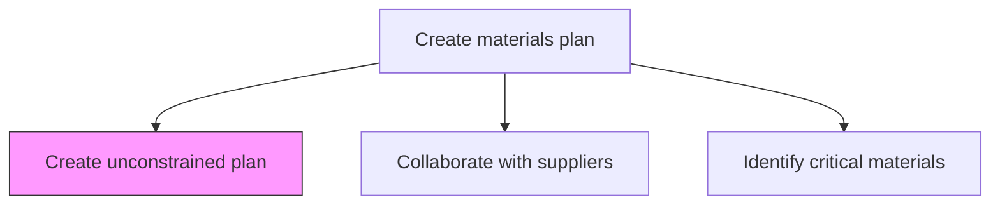
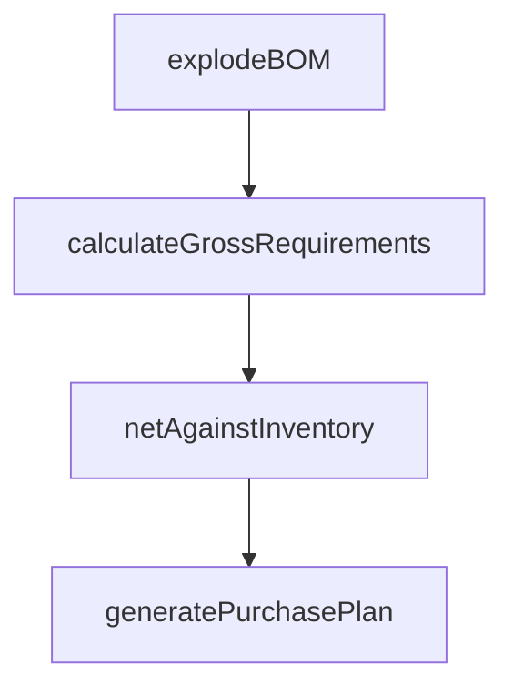

# Create unconstrained plan

> Business-as-Code definition for unconstrained materials plan creation. Models demand-driven materials requirements calculation without capacity or supply limitations as a programmable planning workflow.

## Overview

Developing a plan for raw materials and other inventory items in order to meet market demand. Ensure the availability of all inventory items such as raw materials and spares. Create a blueprint in line with Define labor and materials policies [10230].

## Process Hierarchy



## GraphDL

```yaml
create:
  object: Unconstrained Plan
  actor: MaterialsPlanner
  result: UnconstrainedMaterialsPlan
```

## Actions

| Action | Description |
|--------|-------------|
| explodeBOM | Decompose finished goods demand into component material requirements |
| calculateGrossRequirements | Compute total material quantities needed to meet demand forecast |
| netAgainstInventory | Subtract on-hand and on-order inventory from gross requirements |
| generatePurchasePlan | Produce time-phased purchase recommendations without constraints |

## Events

| Event | Description |
|-------|-------------|
| bomExploded | Bill-of-materials explosion completed for all demand |
| grossRequirementsCalculated | Total material needs computed for planning horizon |
| inventoryNetted | Net requirements determined after inventory offset |
| purchasePlanGenerated | Unconstrained purchase plan created |

## Searches

| Search | Description |
|--------|-------------|
| getGrossRequirements | Retrieve gross material requirements by item or period |
| getNetRequirements | Query net requirements after inventory netting |
| getUnconstrainedPlan | Retrieve the full unconstrained materials plan |

## Process Flow



## RACI Matrix

| Activity | Responsible | Accountable | Consulted | Informed |
|----------|-------------|-------------|-----------|----------|
| explodeBOM | MaterialsPlanner | MaterialsPlanningManager | ProductEngineering | Procurement |
| generatePurchasePlan | MaterialsPlanner | MaterialsPlanningManager | Finance | SupplyChain |

## Related Processes

| Process | Relationship |
|---------|-------------|
| 4.1.4.2 Collaborate with supplier and contract manufacturers | Downstream - unconstrained plan drives supplier discussions |
| 4.1.4.5 Generate constrained plan | Downstream - unconstrained plan is input to constrained planning |
| 4.1.3.3 Develop demand consensus forecast | Upstream - consensus forecast drives material requirements |

## Related Departments

| Department | Role |
|-----------|------|
| Materials Planning | Primary owner of unconstrained plan creation |
| Product Engineering | Provides BOM data and specifications |
| Procurement | Uses plan output for purchasing decisions |

## Related Occupations

| Occupation | Involvement |
|-----------|-------------|
| Materials Planner | MRP execution and plan generation |
| Materials Planning Manager | Plan review and approval |

## KPIs

| KPI | Description | Unit |
|-----|-------------|------|
| BOM Accuracy | Percentage of BOMs with correct component data | % |
| Plan Generation Cycle Time | Time to produce unconstrained materials plan | Hours |
| Netting Accuracy | Accuracy of inventory offset calculations | % |

## Usage

```typescript
import { createUnconstrainedPlan } from '@headlessly/create-unconstrained-plan'

const client = createUnconstrainedPlan()

// Generate purchase plan
const plan = await client.generatePurchasePlan({
  demandForecastId: 'DF-2025-Q3',
  planningHorizon: 12,
  granularity: 'weekly',
  includeSpares: true
})
```
