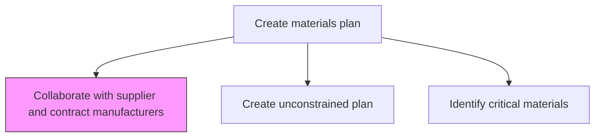
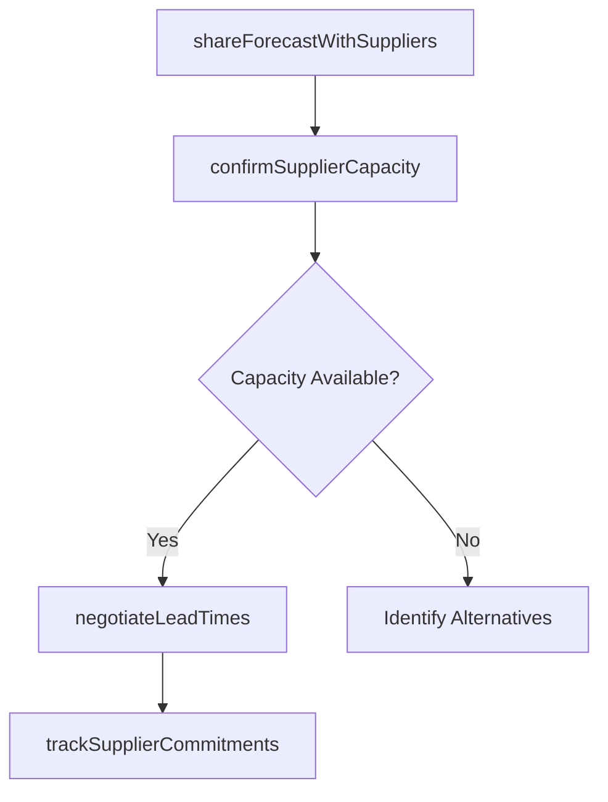

# Collaborate with supplier and contract manufacturers

> Business-as-Code definition for supplier and contract manufacturer collaboration. Models supply planning communications, capacity sharing, lead-time management, and joint forecasting as programmable collaboration workflows.

## Overview

Collaborating with vendors and contractual manufacturers with the objective of ensuring a continual supply of raw materials and spares. Leverage long-term connections/relationships with various suppliers, and cultivate new ones. Track the activities of all vendors. Receive regular updates to prepare for any fluctuations in supply.

## Process Hierarchy



## GraphDL

```yaml
collaborate:
  object: With Supplier And Contract Manufacturers
  actor: SupplierPlanningCoordinator
  result: SupplierCollaborationAgreement
```

## Actions

| Action | Description |
|--------|-------------|
| shareForecastWithSuppliers | Communicate demand forecasts and material plans to suppliers |
| confirmSupplierCapacity | Validate supplier ability to meet planned material volumes |
| negotiateLeadTimes | Agree on lead times and delivery schedules with suppliers |
| trackSupplierCommitments | Monitor supplier adherence to agreed supply commitments |

## Events

| Event | Description |
|-------|-------------|
| forecastSharedWithSuppliers | Demand forecast communicated to supplier base |
| supplierCapacityConfirmed | Supplier capacity validated for planning period |
| leadTimesNegotiated | Delivery schedules and lead times agreed upon |
| supplierCommitmentsTracked | Supplier performance against commitments reviewed |

## Searches

| Search | Description |
|--------|-------------|
| getSupplierCommitments | Retrieve supplier confirmed quantities and dates |
| getSupplierCapacity | Query supplier available capacity by material or period |
| getCollaborationHistory | Retrieve history of supplier planning interactions |

## Process Flow



## RACI Matrix

| Activity | Responsible | Accountable | Consulted | Informed |
|----------|-------------|-------------|-----------|----------|
| shareForecastWithSuppliers | SupplierPlanningCoordinator | MaterialsPlanningManager | Procurement | Suppliers |
| confirmSupplierCapacity | ProcurementBuyer | MaterialsPlanningManager | SupplierPlanningCoordinator | Production |

## Related Processes

| Process | Relationship |
|---------|-------------|
| 4.1.4.1 Create unconstrained plan | Upstream - unconstrained plan drives supplier discussions |
| 4.1.4.3 Identify critical materials and supplier capacity | Parallel - critical materials require focused collaboration |
| 4.2.5 Manage suppliers | Parallel - supplier management provides relationship context |

## Related Departments

| Department | Role |
|-----------|------|
| Materials Planning | Coordinates forecast sharing and capacity confirmation |
| Procurement | Manages supplier relationships and contracts |
| Supply Chain | Oversees overall supplier collaboration strategy |

## Related Occupations

| Occupation | Involvement |
|-----------|-------------|
| Supplier Planning Coordinator | Supplier communication and forecast sharing |
| Procurement Buyer | Lead time negotiation and commitment tracking |

## KPIs

| KPI | Description | Unit |
|-----|-------------|------|
| Supplier Confirmation Rate | Percentage of planned volumes confirmed by suppliers | % |
| Lead Time Adherence | Percentage of deliveries meeting agreed lead times | % |
| Collaboration Frequency | Number of planning sessions with key suppliers per quarter | Count |

## Usage

```typescript
import { collaborateWithSupplierAndContractManufacturers } from '@headlessly/collaborate-with-supplier-and-contract-manufacturers'

const client = collaborateWithSupplierAndContractManufacturers()

// Share forecast with suppliers
const sharing = await client.shareForecastWithSuppliers({
  supplierId: 'SUP-3200',
  materialIds: ['MAT-001', 'MAT-002'],
  forecastHorizon: '6-months',
  confidentiality: 'restricted'
})
```
