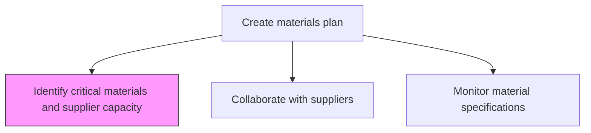
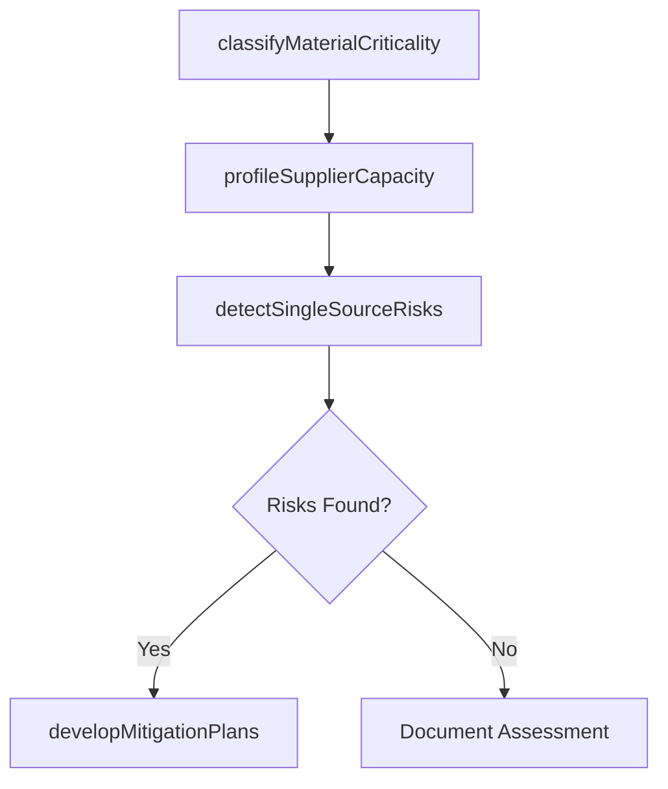

# Identify critical materials and supplier capacity

> Business-as-Code definition for critical materials and supplier capacity identification. Models material criticality assessment, supplier capacity profiling, single-source risk detection, and mitigation planning as programmable risk workflows.

## Overview

Identifying principal materials needed for the manufacturing process and the levels of supply that may be ensured for them. Determine the essential and crucial inventory items required for the smooth functioning of all manufacturing processes. Estimate the average, peak, and baseline capacities of various vendors and suppliers. Establish the capability of individual suppliers from the market and the vendors.

## Process Hierarchy



## GraphDL

```yaml
identify:
  object: Critical Materials And Supplier Capacity
  actor: SupplyRiskAnalyst
  result: CriticalMaterialsAssessment
```

## Actions

| Action | Description |
|--------|-------------|
| classifyMaterialCriticality | Rate materials by impact on production if supply is disrupted |
| profileSupplierCapacity | Document baseline, average, and peak capacity for each supplier |
| detectSingleSourceRisks | Identify materials dependent on a single supplier |
| developMitigationPlans | Create contingency plans for critical material supply risks |

## Events

| Event | Description |
|-------|-------------|
| materialCriticalityClassified | Materials rated by supply risk and production impact |
| supplierCapacityProfiled | Supplier capacity data documented and analyzed |
| singleSourceRisksDetected | Single-source dependencies identified and flagged |
| mitigationPlansDeveloped | Contingency plans created for high-risk materials |

## Searches

| Search | Description |
|--------|-------------|
| getCriticalMaterials | Retrieve materials classified as critical by risk level |
| getSupplierCapacityProfile | Query supplier capacity data by material or vendor |
| getSingleSourceRisks | List materials with single-source supply dependency |

## Process Flow



## RACI Matrix

| Activity | Responsible | Accountable | Consulted | Informed |
|----------|-------------|-------------|-----------|----------|
| classifyMaterialCriticality | SupplyRiskAnalyst | MaterialsPlanningManager | Engineering, Procurement | Executive |
| developMitigationPlans | SupplyRiskAnalyst | MaterialsPlanningManager | Procurement, Production | Finance |

## Related Processes

| Process | Relationship |
|---------|-------------|
| 4.1.4.2 Collaborate with supplier and contract manufacturers | Parallel - supplier collaboration informs capacity data |
| 4.1.1.6 Define production network and supply constraints | Upstream - network constraints contextualize criticality |
| 4.2.5 Manage suppliers | Parallel - supplier management tracks performance data |

## Related Departments

| Department | Role |
|-----------|------|
| Materials Planning | Primary owner of critical materials identification |
| Procurement | Provides supplier capacity and alternative source data |
| Risk Management | Supports risk assessment methodology |

## Related Occupations

| Occupation | Involvement |
|-----------|-------------|
| Supply Risk Analyst | Criticality assessment and mitigation planning |
| Materials Planning Manager | Risk review and approval |

## KPIs

| KPI | Description | Unit |
|-----|-------------|------|
| Critical Materials Coverage | Percentage of critical materials with mitigation plans | % |
| Single-Source Exposure | Percentage of materials with only one qualified supplier | % |
| Supplier Capacity Headroom | Average excess capacity available from key suppliers | % |

## Usage

```typescript
import { identifyCriticalMaterialsAndSupplierCapacity } from '@headlessly/identify-critical-materials-and-supplier-capacity'

const client = identifyCriticalMaterialsAndSupplierCapacity()

// Classify material criticality
const assessment = await client.classifyMaterialCriticality({
  productLine: 'Automotive Components',
  riskFactors: ['supply-concentration', 'lead-time', 'substitutability'],
  thresholdLevel: 'high'
})
```
