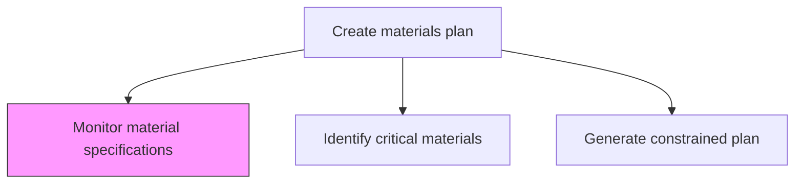
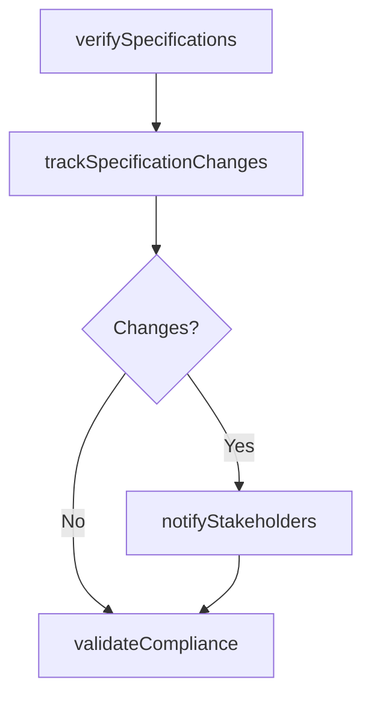

# Monitor material specifications

> Business-as-Code definition for material specification monitoring. Models specification verification, change tracking, compliance validation, and supplier notification as programmable surveillance workflows.

## Overview

Observing and surveying all inventory items in order to check for the veracity of their specifications. Monitor various attributes and characteristics for respective inventory items such as density, volume, and size, as well as contextualized specifications particular to the respective materials.

## Process Hierarchy



## GraphDL

```yaml
monitor:
  object: Material Specifications
  actor: MaterialsEngineer
  result: SpecificationComplianceReport
```

## Actions

| Action | Description |
|--------|-------------|
| verifySpecifications | Validate material attributes against documented specifications |
| trackSpecificationChanges | Monitor engineering changes that affect material requirements |
| validateCompliance | Confirm incoming materials meet specification tolerances |
| notifyStakeholders | Alert procurement and production of specification changes |

## Events

| Event | Description |
|-------|-------------|
| specificationsVerified | Material attributes validated against specifications |
| specificationChangesTracked | Engineering changes to material specs documented |
| complianceValidated | Incoming material compliance confirmed |
| stakeholdersNotified | Specification change alerts distributed |

## Searches

| Search | Description |
|--------|-------------|
| getMaterialSpecifications | Retrieve specifications for a material by ID or category |
| getSpecificationChanges | Query recent specification changes by material or date |
| getComplianceResults | Retrieve specification compliance test results |

## Process Flow



## RACI Matrix

| Activity | Responsible | Accountable | Consulted | Informed |
|----------|-------------|-------------|-----------|----------|
| verifySpecifications | MaterialsEngineer | MaterialsPlanningManager | QA, Suppliers | Production |
| trackSpecificationChanges | MaterialsEngineer | MaterialsPlanningManager | Engineering | Procurement |

## Related Processes

| Process | Relationship |
|---------|-------------|
| 4.1.4.3 Identify critical materials and supplier capacity | Parallel - critical material specs require close monitoring |
| 4.2.5.4 Monitor quality of product delivered | Downstream - spec compliance feeds quality monitoring |
| 4.3.3 Perform quality testing | Downstream - specifications define test criteria |

## Related Departments

| Department | Role |
|-----------|------|
| Materials Engineering | Primary owner of specification monitoring |
| Quality Assurance | Validates compliance against specifications |
| Procurement | Communicates changes to suppliers |

## Related Occupations

| Occupation | Involvement |
|-----------|-------------|
| Materials Engineer | Specification verification and change tracking |
| Quality Inspector | Incoming material compliance testing |

## KPIs

| KPI | Description | Unit |
|-----|-------------|------|
| Specification Compliance Rate | Percentage of incoming materials meeting specifications | % |
| Change Notification Timeliness | Time from spec change to stakeholder notification | Hours |
| Specification Currency | Percentage of material specs reviewed within cycle | % |

## Usage

```typescript
import { monitorMaterialSpecifications } from '@headlessly/monitor-material-specifications'

const client = monitorMaterialSpecifications()

// Verify specifications
const result = await client.verifySpecifications({
  materialId: 'MAT-4500',
  attributes: ['tensile-strength', 'density', 'purity'],
  toleranceMode: 'strict'
})
```
