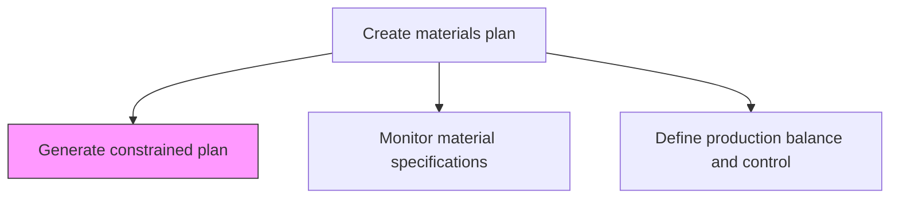
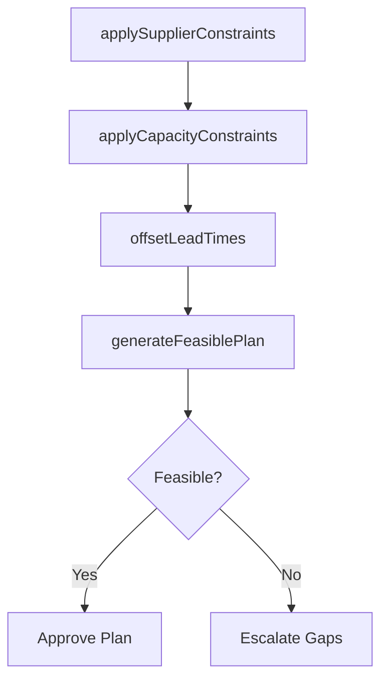

# Generate constrained plan

> Business-as-Code definition for constrained materials plan generation. Models capacity-limited planning, supplier constraint application, lead-time offsetting, and feasible plan creation as programmable planning workflows.

## Overview

Generating a bounded plan that takes stock of the actual supply chain scenario. Take stock of all information collected while creating an inventory supply plan.

## Process Hierarchy



## GraphDL

```yaml
generate:
  object: Constrained Plan
  actor: MaterialsPlanner
  result: ConstrainedMaterialsPlan
```

## Actions

| Action | Description |
|--------|-------------|
| applySupplierConstraints | Limit purchase plan to confirmed supplier capacity |
| applyCapacityConstraints | Bound plan by production and storage capacity limits |
| offsetLeadTimes | Adjust order timing based on actual supplier lead times |
| generateFeasiblePlan | Produce a materials plan achievable within all constraints |

## Events

| Event | Description |
|-------|-------------|
| supplierConstraintsApplied | Purchase plan bounded by supplier capacity |
| capacityConstraintsApplied | Plan limited by production and storage constraints |
| leadTimesOffset | Order dates adjusted for actual lead times |
| feasiblePlanGenerated | Constrained materials plan completed |

## Searches

| Search | Description |
|--------|-------------|
| getConstrainedPlan | Retrieve constrained plan by period or material |
| getConstraintSummary | Query which constraints are binding in the plan |
| getPlanFeasibility | Check feasibility status of the constrained plan |

## Process Flow



## RACI Matrix

| Activity | Responsible | Accountable | Consulted | Informed |
|----------|-------------|-------------|-----------|----------|
| applySupplierConstraints | MaterialsPlanner | MaterialsPlanningManager | Procurement | SupplyChain |
| generateFeasiblePlan | MaterialsPlanner | MaterialsPlanningManager | Production, Finance | Executive |

## Related Processes

| Process | Relationship |
|---------|-------------|
| 4.1.4.1 Create unconstrained plan | Upstream - unconstrained plan is constrained by real-world limits |
| 4.1.4.3 Identify critical materials and supplier capacity | Upstream - critical materials data informs constraints |
| 4.1.5 Create and manage master production schedule | Downstream - constrained plan feeds MPS |

## Related Departments

| Department | Role |
|-----------|------|
| Materials Planning | Primary owner of constrained plan generation |
| Production | Provides capacity constraint data |
| Procurement | Confirms supplier lead times and capacity limits |

## Related Occupations

| Occupation | Involvement |
|-----------|-------------|
| Materials Planner | Constraint application and plan generation |
| Materials Planning Manager | Plan feasibility review and approval |

## KPIs

| KPI | Description | Unit |
|-----|-------------|------|
| Plan Feasibility Rate | Percentage of constrained plan achieving feasibility on first pass | % |
| Constraint Gap Volume | Total volume of demand not coverable within constraints | Units |
| Plan Adherence | Actual procurement versus constrained plan | % |

## Usage

```typescript
import { generateConstrainedPlan } from '@headlessly/generate-constrained-plan'

const client = generateConstrainedPlan()

// Generate feasible plan
const plan = await client.generateFeasiblePlan({
  unconstrainedPlanId: 'UCP-2025-Q3',
  constraints: ['supplier-capacity', 'warehouse-space', 'production-capacity'],
  prioritizationRule: 'revenue-weighted'
})
```
