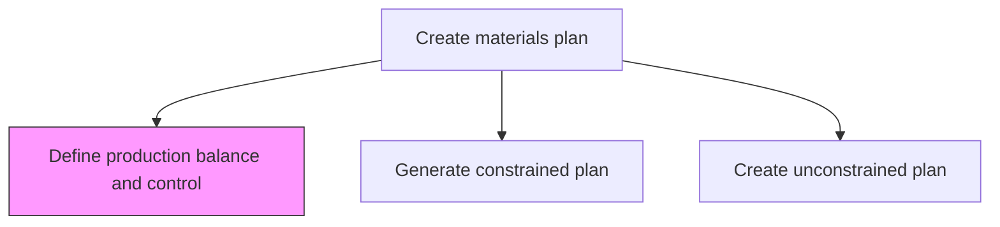
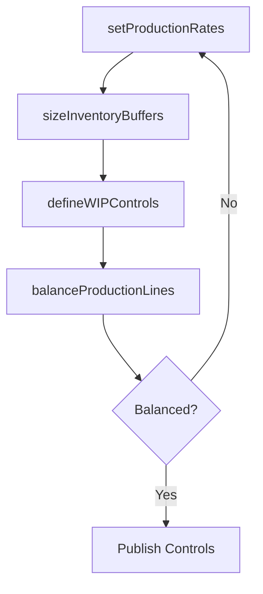

# Define production balance and control

> Business-as-Code definition for production balance and control definition. Models production rate leveling, inventory buffer sizing, work-in-process control, and line balancing as programmable production control configurations.

## Overview

Defining an equitable volume for the production of products/services that adheres to an equilibrium value, and creating a scheme of control for processing items. Create schematics for systematically planning, coordinating, and directing the manufacturing activities in line with the production balance determined.

## Process Hierarchy



## GraphDL

```yaml
define:
  object: Production Balance And Control
  actor: ProductionControlManager
  result: ProductionControlScheme
```

## Actions

| Action | Description |
|--------|-------------|
| setProductionRates | Define balanced production rates across work centers |
| sizeInventoryBuffers | Determine safety stock and buffer inventory levels |
| defineWIPControls | Establish work-in-process limits and kanban parameters |
| balanceProductionLines | Optimize workload distribution across production lines |

## Events

| Event | Description |
|-------|-------------|
| productionRatesSet | Balanced production rates defined for all work centers |
| inventoryBuffersSized | Safety stock and buffer levels established |
| wipControlsDefined | Work-in-process control parameters documented |
| productionLinesBalanced | Workload equitably distributed across lines |

## Searches

| Search | Description |
|--------|-------------|
| getProductionRates | Retrieve production rates by work center or product |
| getBufferLevels | Query safety stock and buffer inventory targets |
| getWIPStatus | Check current WIP levels against control limits |

## Process Flow



## RACI Matrix

| Activity | Responsible | Accountable | Consulted | Informed |
|----------|-------------|-------------|-----------|----------|
| setProductionRates | ProductionControlManager | ManufacturingDirector | DemandPlanning | Finance |
| balanceProductionLines | IndustrialEngineer | ProductionControlManager | ProductionLeads | HR |

## Related Processes

| Process | Relationship |
|---------|-------------|
| 4.1.4.5 Generate constrained plan | Upstream - constrained plan drives production rate targets |
| 4.3.1 Schedule production | Downstream - production controls guide scheduling |
| 4.3.2 Produce/Assemble product | Downstream - WIP controls govern shop floor execution |

## Related Departments

| Department | Role |
|-----------|------|
| Production Control | Primary owner of balance and control definitions |
| Manufacturing Engineering | Provides line balancing analysis |
| Inventory Control | Manages buffer and safety stock levels |

## Related Occupations

| Occupation | Involvement |
|-----------|-------------|
| Production Control Manager | Balance and control scheme ownership |
| Industrial Engineer | Line balancing and rate optimization |

## KPIs

| KPI | Description | Unit |
|-----|-------------|------|
| Production Rate Adherence | Actual output versus planned balanced rate | % |
| WIP Turns | Inventory turns for work-in-process materials | Turns/Year |
| Line Balance Efficiency | Ratio of total task time to available cycle time | % |

## Usage

```typescript
import { defineProductionBalanceAndControl } from '@headlessly/define-production-balance-and-control'

const client = defineProductionBalanceAndControl()

// Set production rates
const rates = await client.setProductionRates({
  workCenter: 'WC-ASSEMBLY-01',
  targetRate: 120,
  rateUnit: 'units-per-shift',
  levelingStrategy: 'mixed-model'
})
```
