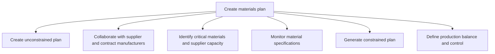
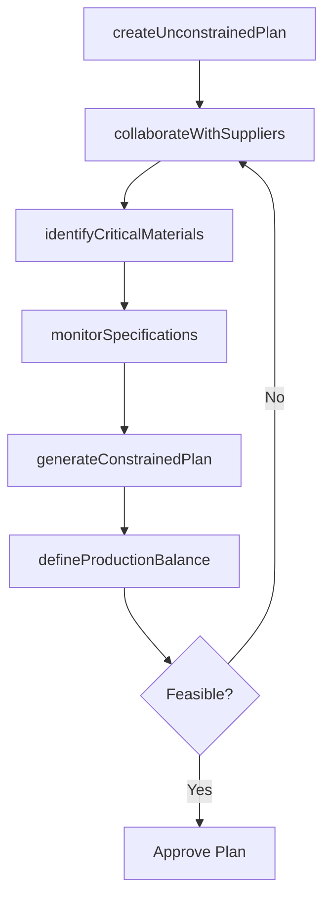

# Create materials plan

> Business-as-Code definition for materials requirements planning. Models unconstrained and constrained planning, supplier collaboration, critical materials identification, and production balance control as programmable workflows.

## Overview

Developing a scheme that allows for advance planning for the availability of raw materials and spares. Start with an unconstrained plan, and refine based on supply chain realities by identifying critical materials required for production, checking material specifications, and collaborating with all vendors over the supply.

## Process Hierarchy



## GraphDL

```yaml
create:
  object: Materials Plan
  actor: MaterialsPlanner
  result: ConstrainedMaterialsPlan
```

## Actions

| Action | Description |
|--------|-------------|
| createUnconstrainedPlan | Generate ideal materials plan based on demand without constraints |
| collaborateWithSuppliers | Engage suppliers and contract manufacturers on capacity |
| identifyCriticalMaterials | Flag high-risk materials with limited supplier capacity |
| monitorSpecifications | Track material specification changes and compliance |
| generateConstrainedPlan | Produce feasible plan factoring actual supply constraints |
| defineProductionBalance | Set production volume equilibrium aligned with supply |

## Events

| Event | Description |
|-------|-------------|
| unconstrainedPlanCreated | Ideal materials requirements plan generated |
| supplierCollaborated | Supplier capacity and lead time data collected |
| criticalMaterialsIdentified | Supply-constrained materials flagged and mitigated |
| specificationsMonitored | Material specification compliance verified |
| constrainedPlanGenerated | Feasible materials plan approved with supply constraints |
| productionBalanceDefined | Production volume equilibrium established |

## Searches

| Search | Description |
|--------|-------------|
| getMaterialsRequirements | Retrieve material requirements by product or time period |
| findCriticalMaterials | List materials at risk of supply shortage |
| getSupplierCapacity | Query supplier capacity and lead time by material |
| getConstraintSummary | Retrieve supply constraints impacting the materials plan |

## Process Flow



## RACI Matrix

| Activity | Responsible | Accountable | Consulted | Informed |
|----------|-------------|-------------|-----------|----------|
| createUnconstrainedPlan | MaterialsPlanner | VP SupplyChain | DemandPlanning | Production |
| collaborateWithSuppliers | ProcurementSpecialist | MaterialsPlanner | Suppliers | Finance |
| identifyCriticalMaterials | SupplyRiskAnalyst | VP Procurement | Logistics | Executive |
| generateConstrainedPlan | MaterialsPlanner | VP SupplyChain | Production, Procurement | Finance |

## Sub-Processes

| ID | Name | Description |
|----|------|-------------|
| 4.1.4.1 | Create unconstrained plan | Developing a plan for raw materials and other inventory items in order to meet market demand. Ensure |
| 4.1.4.2 | Collaborate with supplier and contract manufacturers | Collaborating with vendors and contractual manufacturers with the objective of ensuring a continual  |
| 4.1.4.3 | Identify critical materials and supplier capacity | Identifying principal materials needed for the manufacturing process and the levels of supply that m |
| 4.1.4.4 | Monitor material specifications | Observing and surveying all inventory items in order to check for the veracity of their specificatio |
| 4.1.4.5 | Generate constrained plan | Generating a bounded plan that takes stock of the actual supply chain scenario. Take stock of all in |
| 4.1.4.6 | Define production balance and control | Defining an equitable volume for the production of products/services that adheres to an equilibrium  |

## Related Processes

| Process | Relationship |
|---------|-------------|
| 4.1.3 Manage demand for products | Upstream - demand forecast drives material requirements |
| 4.1.5 Create and manage master production schedule | Downstream - materials availability enables MPS |
| 4.2 Procure materials and services | Downstream - materials plan triggers procurement |

## Related Departments

| Department | Role |
|-----------|------|
| Materials Planning | Primary owner of MRP and constrained planning |
| Procurement | Provides supplier capacity and lead time data |
| Production | Defines material consumption rates and BOM requirements |
| Quality | Validates material specification compliance |

## Related Occupations

| Occupation | Involvement |
|-----------|-------------|
| Materials Planner | MRP execution and constraint management |
| Supply Risk Analyst | Critical materials identification and mitigation |
| Procurement Specialist | Supplier collaboration and capacity verification |

## KPIs

| KPI | Description | Unit |
|-----|-------------|------|
| Materials Availability | Percentage of required materials available on time | % |
| Stockout Rate | Frequency of production stoppages due to material shortages | Events/Month |
| Plan Accuracy | Variance between planned and actual material consumption | % |
| Supplier Lead Time Adherence | Percentage of materials received within quoted lead time | % |

## Usage

```typescript
import { createMaterialsPlan } from '@headlessly/create-materials-plan'

const client = createMaterialsPlan()

// Create unconstrained plan from demand forecast
const unconstrained = await client.createUnconstrainedPlan({
  demandForecastId: 'DF-2025-Q3',
  bomVersion: 'current',
  planningHorizon: { weeks: 16 }
})

// Identify at-risk materials
const risks = await client.identifyCriticalMaterials({
  planId: unconstrained.id,
  riskThreshold: 'high',
  includeSingleSource: true
})

// Generate constrained plan
const constrained = await client.generateConstrainedPlan({
  unconstrainedPlanId: unconstrained.id,
  supplierCapacity: 'latest',
  safetyStockPolicy: 'standard'
})
```
