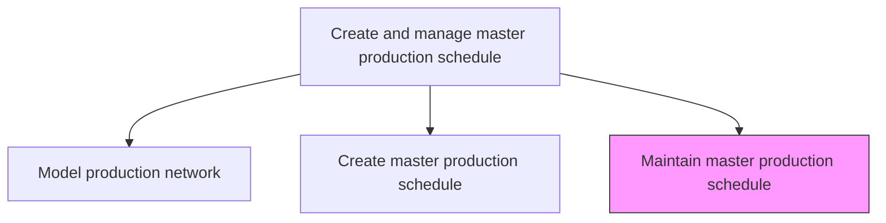
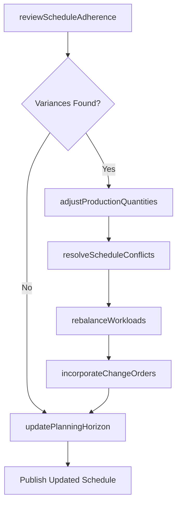

# Maintain master production schedule

> Business-as-Code definition for maintaining the master production schedule. Models the ongoing management, adjustment, and optimization of production scheduling across planning horizons.

## Overview

Supervising and overseeing the plan for internal activities such as production, inventory, and staffing. Set the quantity of items to produce each week of a short-range planning horizon.

## Process Hierarchy



## GraphDL

```yaml
maintain:
  object: Master Production Schedule
  actor: ProductionPlanner
  result: UpdatedProductionSchedule
```

## Actions

| Action | Description |
|--------|-------------|
| reviewScheduleAdherence | Evaluate current production against planned schedule milestones |
| adjustProductionQuantities | Modify weekly production quantities based on demand changes or capacity shifts |
| resolveScheduleConflicts | Identify and resolve resource conflicts across production lines |
| updatePlanningHorizon | Extend or shift the rolling planning window for upcoming periods |
| incorporateChangeOrders | Integrate engineering change orders and product revisions into the schedule |
| rebalanceWorkloads | Redistribute production loads across lines to optimize throughput |

## Events

| Event | Description |
|-------|-------------|
| scheduleAdherenceReviewed | Production schedule adherence assessment completed |
| productionQuantitiesAdjusted | Weekly production quantities modified and communicated |
| scheduleConflictsResolved | Resource conflicts identified and resolution applied |
| planningHorizonUpdated | Rolling planning horizon extended or shifted |
| changeOrdersIncorporated | Engineering changes reflected in production schedule |
| workloadsRebalanced | Production loads redistributed across manufacturing lines |

## Searches

| Search | Description |
|--------|-------------|
| getScheduleVariances | Retrieve deviations between planned and actual production output |
| findConflictingOrders | Identify production orders competing for the same resources or time slots |
| getCapacityForecast | Query available capacity by production line and time period |
| getChangeOrderQueue | List pending engineering change orders awaiting schedule integration |

## Process Flow



## RACI Matrix

| Activity | Responsible | Accountable | Consulted | Informed |
|----------|-------------|-------------|-----------|----------|
| reviewScheduleAdherence | ProductionPlanner | PlantManager | Manufacturing | SupplyChain |
| adjustProductionQuantities | ProductionPlanner | VP Operations | DemandPlanning, Sales | Procurement |
| resolveScheduleConflicts | ProductionScheduler | PlantManager | MaintenanceTeam | QualityAssurance |
| rebalanceWorkloads | ProductionPlanner | VP Operations | LineManagers | Finance |

## Related Processes

| Process | Relationship |
|---------|-------------|
| 4.1.5.1 Model production network to enable simulation and optimization | Upstream - network model informs schedule adjustments |
| 4.1.5.2 Create master production schedule | Upstream - initial schedule is maintained by this process |
| 4.1.3 Manage demand for products | Upstream - demand changes trigger schedule maintenance |
| 4.3.1 Schedule production | Downstream - detailed scheduling consumes master schedule |

## Related Departments

| Department | Role |
|-----------|------|
| Production Planning | Primary owner of schedule maintenance and adjustments |
| Manufacturing | Provides actual production data and capacity constraints |
| Supply Chain Planning | Supplies demand signals and materials availability |
| Quality Assurance | Flags quality holds affecting schedule feasibility |

## Related Occupations

| Occupation | Involvement |
|-----------|-------------|
| Production Planner | Primary executor of schedule maintenance |
| Plant Manager | Approves major schedule changes |
| Supply Chain Analyst | Provides demand and supply alignment data |

## KPIs

| KPI | Description | Unit |
|-----|-------------|------|
| Schedule Adherence Rate | Percentage of planned production quantities achieved on time | % |
| Schedule Change Frequency | Number of unplanned schedule modifications per period | Count/Month |
| Conflict Resolution Time | Average time to resolve scheduling conflicts | Hours |
| Planning Horizon Coverage | Number of weeks covered by the current rolling schedule | Weeks |

## Usage

```typescript
import { maintainMasterProductionSchedule } from '@headlessly/maintain-master-production-schedule'

const mps = maintainMasterProductionSchedule()

// Review adherence to current schedule
const variances = await mps.reviewScheduleAdherence({
  plantId: 'plant-midwest-01',
  periodStart: '2025-07-01',
  periodEnd: '2025-07-07'
})

// Adjust quantities based on demand shift
await mps.adjustProductionQuantities({
  scheduleId: variances.scheduleId,
  lineItems: [
    { sku: 'WIDGET-A', weekOf: '2025-07-14', newQuantity: 1200 }
  ],
  reason: 'demand-increase'
})
```
