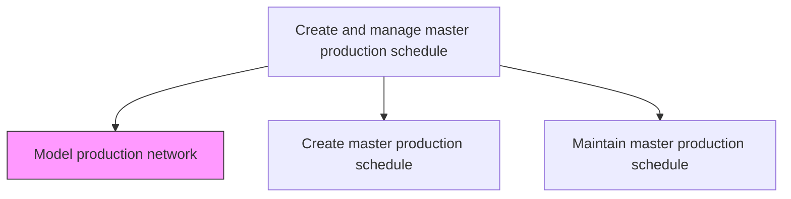
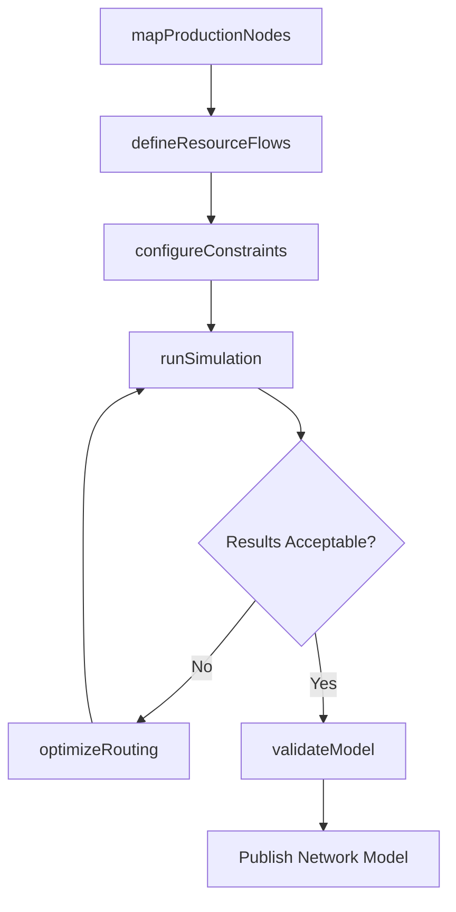

# Model production network to enable simulation and optimization

> Business-as-Code definition for modeling the production network. Enables digital twin simulation and optimization of manufacturing capacity, resource flows, and product routing across plants.

## Overview

Create representative logical system that provides the framework to attain strategic objectives based on resources, product volumes, and processes. Provides the general sequential flow and capacity requirement relationships among raw materials, parts, resources, finished products, and product families.

## Process Hierarchy



## GraphDL

```yaml
model:
  object: Production Network To Enable Simulation And Optimization
  actor: IndustrialEngineer
  result: ProductionNetworkModel
```

## Actions

| Action | Description |
|--------|-------------|
| mapProductionNodes | Define plants, lines, and work centers as nodes in the network graph |
| defineResourceFlows | Establish material and capacity flow relationships between nodes |
| configureConstraints | Set capacity limits, lead times, and sequencing rules for each node |
| runSimulation | Execute what-if scenarios to evaluate network performance under varying conditions |
| optimizeRouting | Apply optimization algorithms to determine best product routing across the network |
| validateModel | Compare model outputs against historical production data for accuracy |

## Events

| Event | Description |
|-------|-------------|
| productionNodesMapped | All production facilities and work centers defined in the network model |
| resourceFlowsDefined | Material and capacity flow paths established between network nodes |
| constraintsConfigured | Capacity limits and sequencing rules applied to the model |
| simulationCompleted | What-if simulation scenario executed and results generated |
| routingOptimized | Optimal product routing determined across the production network |
| modelValidated | Network model accuracy verified against historical data |

## Searches

| Search | Description |
|--------|-------------|
| getNetworkTopology | Retrieve the current production network graph with all nodes and edges |
| findBottlenecks | Identify capacity-constrained nodes limiting overall throughput |
| getSimulationResults | Query results from a specific simulation scenario run |
| compareScenarios | Retrieve side-by-side comparison of multiple simulation scenarios |

## Process Flow



## RACI Matrix

| Activity | Responsible | Accountable | Consulted | Informed |
|----------|-------------|-------------|-----------|----------|
| mapProductionNodes | IndustrialEngineer | VP Manufacturing | PlantManagers | SupplyChain |
| runSimulation | OperationsAnalyst | VP Operations | ProductionPlanning | Finance |
| optimizeRouting | IndustrialEngineer | VP Manufacturing | Logistics, QA | Executive |
| validateModel | OperationsAnalyst | PlantManager | Manufacturing | IT |

## Related Processes

| Process | Relationship |
|---------|-------------|
| 4.1.5.2 Create master production schedule | Downstream - network model informs schedule creation |
| 4.1.1 Develop production and materials strategies | Upstream - production strategy defines network scope |
| 4.3.1 Schedule production | Downstream - model provides constraints for detailed scheduling |

## Related Departments

| Department | Role |
|-----------|------|
| Industrial Engineering | Primary owner of network modeling and optimization |
| Manufacturing | Provides plant-level capacity and process data |
| Supply Chain Planning | Consumes model outputs for demand-supply alignment |
| IT | Maintains simulation platform and data integrations |

## Related Occupations

| Occupation | Involvement |
|-----------|-------------|
| Industrial Engineer | Builds and maintains the production network model |
| Operations Research Analyst | Runs simulations and optimization algorithms |
| Plant Manager | Validates model assumptions against operational reality |

## KPIs

| KPI | Description | Unit |
|-----|-------------|------|
| Model Accuracy | Deviation between simulated and actual production output | % |
| Scenario Turnaround Time | Time to complete a single simulation scenario | Hours |
| Bottleneck Identification Rate | Percentage of actual bottlenecks correctly predicted by the model | % |
| Optimization Savings | Cost reduction achieved through routing optimization | USD/Quarter |

## Usage

```typescript
import { modelProductionNetworkToEnableSimulationAndOptimization } from '@headlessly/model-production-network-to-enable-simulation-and-optimization'

const network = modelProductionNetworkToEnableSimulationAndOptimization()

// Map production facilities into the network model
const topology = await network.mapProductionNodes({
  plants: ['plant-east', 'plant-west', 'plant-central'],
  includeWorkCenters: true
})

// Run a what-if simulation for demand surge
const results = await network.runSimulation({
  modelId: topology.id,
  scenario: 'demand-surge-q4',
  demandMultiplier: 1.3
})
```
