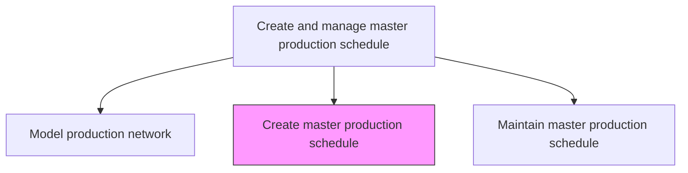
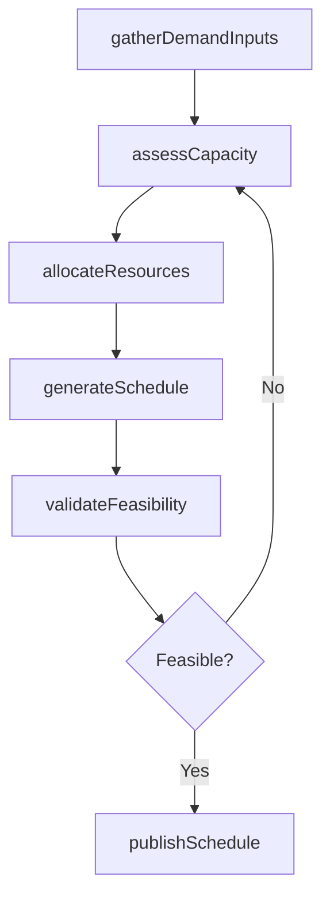

# Create master production schedule

> Business-as-Code definition for creating the master production schedule. Models the translation of demand forecasts and materials plans into a time-phased production plan by product and period.

## Overview

Creating  the plan for internal activities such as production, inventory, and staffing. Include forecasted quantity of items to produce based on inputs from sales planning, demand planning/forecasting, and supply chain partners.

## Process Hierarchy



## GraphDL

```yaml
create:
  object: Master Production Schedule
  actor: ProductionPlanner
  result: MasterProductionSchedule
```

## Actions

| Action | Description |
|--------|-------------|
| gatherDemandInputs | Collect consensus demand forecasts, customer orders, and safety stock targets |
| assessCapacity | Evaluate available production capacity against demand requirements |
| allocateResources | Assign production lines, labor, and equipment to product groups |
| generateSchedule | Build time-phased production plan by SKU and planning period |
| validateFeasibility | Verify schedule against materials availability and capacity constraints |
| publishSchedule | Release approved master production schedule to downstream operations |

## Events

| Event | Description |
|-------|-------------|
| demandInputsGathered | Demand forecasts and customer orders consolidated for planning |
| capacityAssessed | Production capacity evaluated and gaps identified |
| resourcesAllocated | Production lines and labor assigned to product groups |
| scheduleGenerated | Time-phased master production schedule created |
| feasibilityValidated | Schedule confirmed as feasible against materials and capacity |
| schedulePublished | Approved master production schedule released to operations |

## Searches

| Search | Description |
|--------|-------------|
| getDemandSummary | Retrieve consolidated demand by product family and time period |
| getCapacityAvailability | Query available production capacity by line and period |
| getScheduleDraft | Retrieve current draft of the master production schedule |
| findMaterialShortages | Identify materials that may constrain the proposed schedule |

## Process Flow



## RACI Matrix

| Activity | Responsible | Accountable | Consulted | Informed |
|----------|-------------|-------------|-----------|----------|
| gatherDemandInputs | DemandPlanner | VP SupplyChain | Sales, Marketing | Finance |
| assessCapacity | ProductionPlanner | PlantManager | Manufacturing, Maintenance | SupplyChain |
| generateSchedule | ProductionPlanner | VP Operations | MaterialsPlanning | Logistics |
| publishSchedule | ProductionPlanner | VP Operations | QualityAssurance | Procurement |

## Related Processes

| Process | Relationship |
|---------|-------------|
| 4.1.5.1 Model production network to enable simulation and optimization | Upstream - network model provides capacity framework |
| 4.1.5.3 Maintain master production schedule | Downstream - created schedule is subsequently maintained |
| 4.1.3 Manage demand for products | Upstream - demand forecast is primary input |
| 4.1.4 Create materials plan | Parallel - materials plan must align with production schedule |

## Related Departments

| Department | Role |
|-----------|------|
| Production Planning | Primary owner of schedule creation and publication |
| Demand Planning | Provides consensus demand forecasts as key input |
| Manufacturing | Provides capacity data and validates schedule feasibility |
| Procurement | Confirms materials availability for proposed schedule |

## Related Occupations

| Occupation | Involvement |
|-----------|-------------|
| Production Planner | Creates and validates the master production schedule |
| Demand Planner | Supplies demand forecast inputs |
| Materials Planner | Validates materials availability against schedule |

## KPIs

| KPI | Description | Unit |
|-----|-------------|------|
| Schedule Creation Cycle Time | Time from demand input collection to schedule publication | Days |
| First-Pass Feasibility Rate | Percentage of initial schedules passing feasibility validation | % |
| Demand Coverage | Percentage of forecasted demand covered by the production schedule | % |
| Resource Utilization | Percentage of allocated capacity consumed in the schedule | % |

## Usage

```typescript
import { createMasterProductionSchedule } from '@headlessly/create-master-production-schedule'

const mps = createMasterProductionSchedule()

// Gather demand inputs for schedule creation
const demand = await mps.gatherDemandInputs({
  planningHorizon: { weeks: 12 },
  productFamilies: ['electronics', 'components'],
  includeCustomerOrders: true
})

// Generate the master production schedule
const schedule = await mps.generateSchedule({
  demandInputId: demand.id,
  planningPeriod: 'weekly',
  optimizeFor: 'throughput'
})
```
